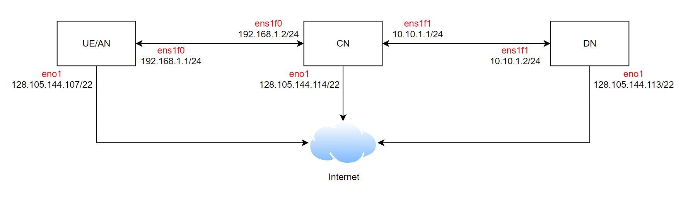

<!--``` diff
- We kindly note that L25GC+ is not yet completely ready because the installation script needs some refinement.
- Please stay tuned for an official release from us.
```  -->

# L25GC+: A Low-latency, 3GPP-compliant 5G Core Network
## About

In this work, we develop L25GC+. L25GC+ is a re-architected 5G Core (5GC) network, aimed at reducing latency and improving user experience. L25GC+ focuses on minimizing the impact of control plane operations on the data plane, while also enhancing data plane processing. It achieves this by exploiting shared memory (based on OpenNetVM), eliminating message serialization and HTTP processing overheads in 3GPP SBI, and using scalable packet classifiers for forwarding-rule lookups. L25GC+ re-designs OpenNetVM's shared-memory-based networking stack to support synchronous I/O between control plane functions, which allows it to distinguish different user sessions and maintains strict 3GPP compliance. L25GC+ also offers seamless integration with existing 5GC microservice implementations through equivalent SBI APIs, reducing code refactoring and porting efforts. Additionally, L25GC+ implements paging and an intelligent handover scheme to reduce delays and data loss. It also offers integrated failure resiliency for faster recovery from failures compared to standard 3GPP procedures.

L25GC+ is built on the open-source kernel-based 5GC implementation called free5GC. By leveraging shared memory I/O, L25GC+ optimizes the 5G control plane, enhancing latency, scalability, and overall user experience. L25GC+ achieves 2X lower data plane latency for paging and handover events compared to free5GC. We demonstrate the improved performance of L25GC+ on a 5G testbed with commercial basestations and UEs. 

<!-- $L^25GC$ is a re-architected 5G Core (5GC) network, aimed at reducing latency and improving user experience. $L^25GC$ focuses on minimizing control plane operations' impact on the data plane and enhancing data plane processing. It achieves this by exploiting shared memory (based on [OpenNetVM](docs/ONVM.md)), eliminating message serialization and HTTP processing overheads in 3GPP SBI, and using scalable packet classifiers for forwarding-rule lookups. Additionally, $L^25GC$ implements paging and an intelligent handover scheme to reduce delays and data loss. It also offers integrated failure resiliency for faster recovery from failures compared to standard 3GPP procedures. $L^25GC$ is built on the open-source kernel-based 5GC implementation called [free5GC](docs/free5GC.md). In tests, $L^25GC$ showed approximately 50% faster event completion time for control plane events and 2X improved data packet latency during paging and handover events compared to free5GC. However, $L^25GC$ has limitations in supporting multiple user sessions and has programming language incompatibilities with 5GC implementations, e.g., free5GC, using modern languages such as GoLang. This unfortunately increases the complexity of code development and the difficulty of code maintenance and updates of $L^25GC$. -->

<!-- To address these challenges, we develop $L^25GC+$, a significant enhancement to $L^25GC$. $L^25GC+$ re-designs the shared-memory-based networking stack to support synchronous I/O between control plane functions. $L^25GC+$ distinguishes different user sessions and maintains strict 3GPP compliance. $L^25GC+$ also offers seamless integration with existing 5GC microservice implementations through equivalent SBI APIs, reducing code refactoring and porting efforts. By leveraging shared memory I/O and overcoming $L^25GC$’s limitations, $L^25GC+$ provides an improved solution to optimize the 5G control plane, enhancing latency, scalability, and overall user experience. We demonstrate the improved performance of $L^25GC+$ on a 5G testbed with commercial basestations and multiple UEs. -->

For more design details, please refer to:
- SIGCOMM 2022: [L25GC: A Low Latency 5G Core Network based on High-Performance NFV Platforms](docs/papers/l25gc-sigcomm22.pdf)
- CloudNet 2023: [L25GC+: An Improved, 3GPP-compliant 5G Core for Low-latency Control Plane Operations](docs/papers/L25GC%2B.pdf)


## Installation guideline and SIGCOMM artifact evaluation ##
To reproduce the experiment in [our paper](docs/papers/l25gc-sigcomm22.pdf), please refer to [artifact documentation](docs/ARTIFACTS.md).

## Publication ##
~~~
@inproceedings{l25gc-sigcomm22,
author = {Jain, Vivek and Chu, Hao-Tse and Qi, Shixiong and Lee, Chia-An and Chang, Hung-Cheng and Hsieh, Cheng-Ying and Ramakrishnan, K. K. and Chen, Jyh-Cheng},
title = {L25GC: A Low Latency 5G Core Network Based on High-Performance NFV Platforms},
year = {2022},
isbn = {9781450394208},
publisher = {Association for Computing Machinery},
address = {New York, NY, USA},
url = {https://doi.org/10.1145/3544216.3544267},
doi = {10.1145/3544216.3544267},
booktitle = {Proceedings of the ACM SIGCOMM 2022 Conference},
pages = {143–157},
numpages = {15},
keywords = {cellular core, NFV, low latency 5G core, 5G cellular networks},
location = {Amsterdam, Netherlands},
series = {SIGCOMM '22}
}
~~~

## Installation ##
clone L25GC+
~~~
cd ~
git clone https://github.com/nycu-ucr/L25GC-plus.git
~~~
install
~~~
cd ~/L25GC-plus
./install.sh
~~~

## intallation in docker ##
### clone nycu-ucr/onvm
```
sudo apt install libnuma-dev
git clone https://github.com/nycu-ucr/onvm.git
cd onvm
git checkout opensource
source ./build_testbed.sh

cd onvm-upf/scripts
./install.sh
```
press Y/N to bind DPDK NICs, you need at least 2 NICs to run L25GC+

### pull and run docker images
```
sudo apt install docker.io
sudo docker pull linpoyi/l25gc-plus_v0
sudo docker run -it --privileged --name test_v1 linpoyi/l25gc-plus_v0
```

### setup huge pages in container(in container's bash)
```
su linpoyi #password: wirelab020
cd ~/onvm/onvm-upf/dpdk/usertools
./dpdk-setup.sh
49 #setup huge pages
1024 #number of huge pages
62 # exit script
```

### pull and run mongodb images(in new terminal)
```
sudo docker pull mongo
sudo docker run --name db mongo
```

### check docker network
```
docker network inspect bridge
```
find the ipv4 address of container "db"

### modified config in L25GC+(back to L25GC+'s bash)
```
vim ~/L25GC-plus/config/nrfcfg.yaml
```
change "MongoDBUrl" from 127.0.0.1 to the ip address of db container

## Running and Testing ##
run onvm manager
~~~
cd ~/onvm
./run_manager.sh
~~~
run upf-u (in new terminal)
~~~
cd ~/onvm/onvm-upf/5gc/upf_u_complete
sudo ./go.sh 1
~~~
run upf-c (in new terminal)
~~~
cd ~/onvm/onvm-upf/5gc/upf_c_complete
sudo ./go.sh 2
~~~
run NFs (in new terminal)
~~~
cd ~/L25GC-plus
./run.sh
~~~
run Test (in new terminal)
~~~
cd ~/L25GC-plus
./select_test.sh

1) TestRegistration                 4) TestN2Handover
2) TestMultiRegistrationConcurrent  5) TestMultiN2HandoverConcurrent
3) TestMultiPagingConcurrent        6) Quit
~~~

stop L25GC+
~~~
cd ~/onvm
./force_kill.sh
~~~

## Environment Setup
- You could setup the experiment environment by running the provided scrips.
### Steps
1. Adjust the parameters in `scripts/set_nw_env.sh`
    - Reference architecture
        
2. Run the setup script in `scripts` with target environment
    ```
    ./setup.sh <ue|cn|dn>
    ```
3. Follow the `Running and Testing` to run the L25GC+.

## Communication ##
If you have any questions or comments, please feel free to email us (l25gc@googlegroups.com) or join our [Google group](https://groups.google.com/g/l25gc/).

## License
L25GC+ is now under [Apache 2.0](https://github.com/nycu-ucr/L25GC-plus/blob/main/LICENSE) license.
