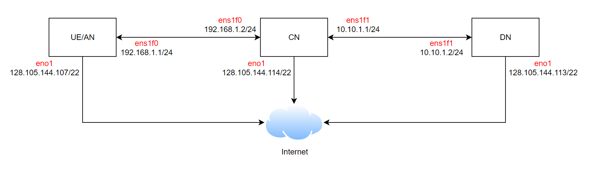

# CloudLab Deployment Guide

This guide describes how to deploy and run **L25GC+** on [**CloudLab**](https://www.cloudlab.us/). It covers the basic environment setup, installation steps, and execution workflow for the **CN**, **UE/RAN**, and **DN** nodes.

If you plan to run L25GC+ on CloudLab, we recommend using our CloudLab profile for correct topology setup. 

- [L25GC+ CloudLab Profile](https://www.cloudlab.us/show-profile.php?uuid=8874719c-5d13-11f0-af1a-e4434b2381fc)

Following this guide, you can bring up L25GC+, run **UERANSIM** for end-to-end validation, and verify connectivity with simple tests such as `ping` and `iperf3`.

## Build and Installation
- **Tested OS**: See [Tested OS Distributions](../../README.md#tested-os-distributions)
- **NIC Requirement**: You need at least **two** [DPDK-compatible NICs](https://core.dpdk.org/supported/nics/) to run L25GC+. 

- Reference topology:
    

### Experiment Setup

1. Configure `N2`, `N3`, and `UPF-U` on the CN node.
2. Configure `UERANSIM` on the UE/AN node.
3. Configure the DN node.
4. Refer to our [setup guide](../../docs/config/README.md) and instructional [video]() for step-by-step configuration of AMF, SMF, UPF-U, and UERANsim gNB.

---

### Installation
1. Run the setup script on target machine
    ```bash
    ./scripts/setup.sh <ue|cn|dn>
    ```

2. NIC interface on `CN` node must be bound to a [compatible DPDK driver](https://core.dpdk.org/supported/nics/) (e.g., `igb_uio`).  
    > *Note:* In some environments, the interface must be brought down before binding.

    ```bash
    sudo ifconfig <interface> down
    sudo ~/L25GC-plus/NFs/onvm-upf/subprojects/dpdk/usertools/dpdk-devbind.py -s
    sudo ~/L25GC-plus/NFs/onvm-upf/subprojects/dpdk/usertools/dpdk-devbind.py -b igb_uio <PCIe addr>
    ```

---

## Running L25GC+
You can use our provided [scripts](scripts/run/) to launch onvm_mgr and L25GC+ NFs. This script assumes the `L25GC-plus` folder is your working directory.

1. **Run ONVM Manager**: Replace `N3_IF_PCIE` and `N6_IF_PCIE` in the ONVM Manager command below with the correct PCIe addresses.
    ```bash
    # Run `dpdk-devbind.py -s` to find `N3_IF_PCIE` and `N6_IF_PCIE`
    ./scripts/run/run_onvm_mgr.sh -a "<N3_IF_PCIE> <N6_IF_PCIE>"
    ```
2. **Run UPF-U** (new terminal)
    ```bash
    ./scripts/run/run_upf_u.sh 1 ./NFs/onvm-upf/5gc/upf_u/config/upf_u.yaml
    ```
3. **Run UPF-C** (new terminal)
    ```bash
    ./scripts/run/run_upf_c.sh 2 ./NFs/onvm-upf/5gc/upf_c/config/upfcfg.yaml
    ```
4. **Run Control Plane NFs** (new terminal)
    ```bash
    source ~/.bashrc
    ./scripts/run/run_cp_nfs.sh && reset && tail -f log/*.log
    ```
    > **View Control Plane NF logs live:**
    ```bash
    tail -f log/*.log
    ```
    > **Note**: If your terminal becomes visually corrupted (e.g., broken prompt, arrow keys not working), you can restore it using:
    ```bash
    reset
    ```
5. **Run Webconsole** (new terminal)
    > The webconsole is used to pre-store UE info in MongoDB for authentication and configure QoS.
    ```bash
    cd webconsole/ 
    ./bin/webconsole
    ```
    See this [video]() or [doc](../../docs/webconsole/README.md) for usage instructions.

6. **Stop L25GC+**
    ```bash
    ./scripts/run/stop_cn.sh
    ```

## Running UERANSIM
This script assumes the `~/L25GC-plus/UERANSIM` folder is your working directory.

1. **Run gNB**
    ```bash
    cd ~/L25GC-plus/UERANSIM
    sudo ./build/nr-gnb -c config/free5gc-gnb.yaml
    ```
2. **Run UE** (new terminal)
    ```bash
    cd ~/L25GC-plus/UERANSIM
    sudo ./build/nr-ue -c config/free5gc-ue.yaml
    ```

## Unit test
1. **Ping Test (UE to DN)**
    ```bash
    # on UE/RAN node
    ping -I uesimtun0 192.168.1.4
    ```
    Replace `192.168.1.4` with the IP of your DN node.
2. **iperf3 Throughput Test**
    ```bash
    # On DN Node:
    iperf3 -s -B 192.168.1.4
    ```

    ```bash
    # On UE/RAN Node:
    iperf3 -c 192.168.1.4 -B 10.60.0.1
    ```
    Replace `192.168.1.4` with the IP of your DN node. Assume `10.60.0.1` is the IP of `UE` (`uesimtun0`).
