## Deploying L25GC+ on NSF FABRIC: Cluster Provisioning, Build, and Installation Tutorial

This tutorial provides a deployment-focused, end-to-end guide to running L25GC+ on NSF FABRIC for users who want full control over configuration and code. Participants will learn how to provision and manage a FABRIC cluster for L25GC+. We then walk through building the complete software stack—compiling dependencies, compiling and installing L25GC+. This tutorial is intended for researchers who plan to self-deploy L25GC+ for customized experiments, performance tuning, or development.

> Intended audience: advanced users, and researchers in cellular networks, people who attend Tutorial 1 and want more information to deploy dedicated core instance for experiments.

---

Here is the server information we will be using:

**Group A:**
```bash
ubuntu@2001:400:a100:3020:f816:3eff:feb4:ceb2 # (UE/RAN node)
ubuntu@2001:400:a100:3020:f816:3eff:fe6d:13c3 # (Core Network node)
ubuntu@2001:400:a100:3020:f816:3eff:fef8:6210 # (Data Network node)
```

**Group B:**
```bash
ubuntu@2001:400:a100:3020:f816:3eff:feb4:ceb2 # (UE/RAN node)
ubuntu@2001:400:a100:3020:f816:3eff:fe6d:13c3 # (Core Network node)
ubuntu@2001:400:a100:3020:f816:3eff:fef8:6210 # (Data Network node)
```

**Group C:**
```bash
ubuntu@2001:400:a100:3020:f816:3eff:feb4:ceb2 # (UE/RAN node)
ubuntu@2001:400:a100:3020:f816:3eff:fe6d:13c3 # (Core Network node)
ubuntu@2001:400:a100:3020:f816:3eff:fef8:6210 # (Data Network node)
```

You will be assigned a specific node.  Please do not use any servers not assigned to you. You may only use these servers for the tutorial; let me know if you want to keep playing with things after the session ends.


We have also released an artifact for creating clusters on Fabric: **[L25GC+ FABRIC Artifact](https://artifacts.fabric-testbed.net/artifacts/078e8c8d-eb8d-4279-b711-85fb217a7db7)**

### Topology Setup
The experimental testbed consists of a UE/RAN node, a Core Network (CN) node, and a Data Network (DN) node, connected through three separate subnets. `subnet-1` is used for the N2 interface between the UE/RAN and the control-plane NFs in the 5G core. `subnet-2` is used for the N3 interface between the UE/RAN and the UPF-U. `subnet-3` is used for the N6 interface between the UPF-U and the DN.

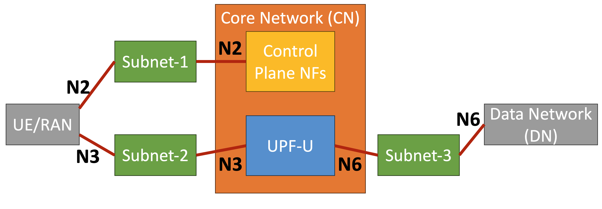

### Example FABRIC Network and Interface Configuration
The screenshot below shows an example network and interface configuration after creating a cluster on the FABRIC testbed. 

Users should pay close attention to four pieces of information for each interface: 
- the node that the interface belongs to (**Node** column)
- the subnet that the interface belongs to (**Network** column)
- the name of the interface (**Physical Device** column)
- the IP address of the interface (**IP Address** column)


These details will be used later during system configuration.

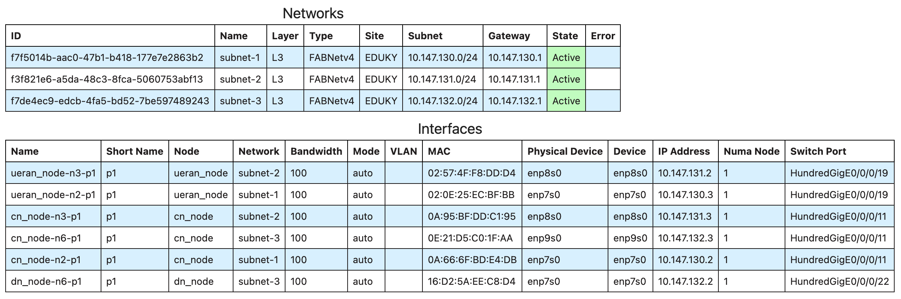

> The exact configuration may vary across users. For example, the subnet ranges and gateway IP addresses assigned to each network may be different in a different cluster.

---

## 1. Log into the Core Network node and Setup Environment
Open **a new terminal** and SSH into your assigned Core Network node.

After you log in, run these commands in the terminal.

### Clone L25GC+ Repository
```bash
cd ~/
git clone https://github.com/nycu-ucr/L25GC-plus.git
```

### Step-1: Install MLNX_OFED on the Core Network node
```bash
cd ~/L25GC-plus/scripts
yes y | bash ./install_ofed.sh
```

### Step-2: Run the setup script to install L25GC+ on the Core Network node
```bash
cd ~/L25GC-plus/
yes y | ./scripts/setup.sh cn
```

### Step-3: Configure AMF
> This step updates the AMF configuration in L25GC+ so that the gNB can reach the AMF over the **N2** interface. The IP configured here must match the actual N2 interface IP address on the Core Network node in your FABRIC cluster. This setting will also be used later when configuring the gNB.

The AMF configuration file is located at:
```bash
~/L25GC-plus/config/amfcfg.yaml
```

Open the file and find the `ngapIpList` field. By default, it is set to `127.0.0.1`, which must be replaced with the actual **N2 IP address** of the Core Network node.

> You can find this IP by checking the FABRIC configuration output table: in the **Interfaces** section, look for the row whose **Name** matches the CN node’s N2 interface (`cn_node-n2-p1`), and then copy the value from the **IP Address** column. In the example shown in [Example FABRIC Network and Interface Configuration](#example-fabric-network-and-interface-configuration), the **N2 IP address** of the Core Network node is `10.147.130.2`.

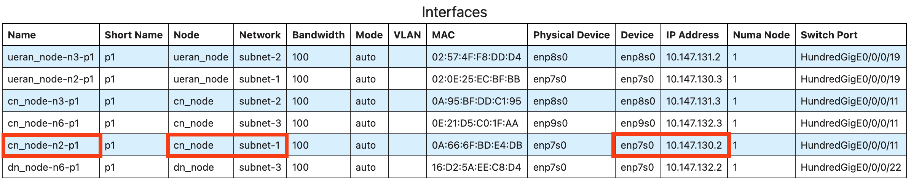

Change:

```yaml
ngapIpList:  # the IP list of N2 interfaces on this AMF
- 127.0.0.1
```

to:

```yaml
ngapIpList:  # the IP list of N2 interfaces on this AMF
- {IP of cn_node-n2-p1 in your FABRIC cluster}
### Replace it with the actual N2 IP address of your own Core Network node! ###
```

> After this change, the AMF will listen on the correct N2 interface and accept NGAP connections from the gNB. If this IP is not configured correctly, the gNB will not be able to connect to the core network. 


### Step-4: Configure SMF
> This step updates the SMF configuration in L25GC+. The SMF needs to provide the correct **N3** interface IP address of the UPF-U during PDU session establishment, so that the gNB can forward user traffic to the UPF-U. The IP configured here must match the actual N3 interface IP address on the Core Network node in your FABRIC cluster.

The SMF configuration file is located at:
```bash
~/L25GC-plus/config/smfcfg.yaml
```

Open the file and find the `endpoints` field. By default, it is set to `127.0.0.8`, which must be replaced with the actual **N3 IP address** of the Core Network node.

> You can find this IP by checking the FABRIC configuration output table: in the **Interfaces** section, look for the row whose **Name** matches the CN node's N3 interface (`cn_node-n3-p1`), and then copy the value from the **IP Address** column. In the example shown in [Example FABRIC Network and Interface Configuration](#example-fabric-network-and-interface-configuration), the **N3 IP address** of the Core Network node is `10.147.131.3`.

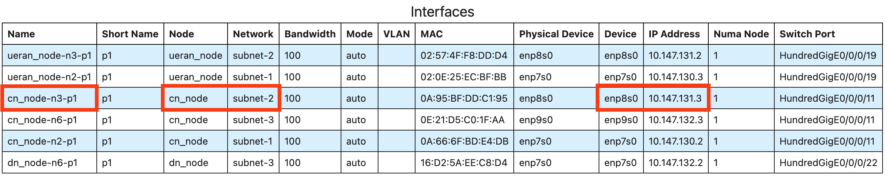

Change:

```yaml
...
  interfaces: # Interface list of the UPF-U
   - interfaceType: N3 # the type of the interface (N3 or N9)
     endpoints: # the IP address of this N3 interface on this UPF
       - 127.0.0.8
```

to:

```yaml
...
  interfaces: # Interface list of the UPF-U
   - interfaceType: N3 # the type of the interface (N3 or N9)
     endpoints: # the IP address of this N3 interface on this UPF
       - {IP of cn_node-n3-p1 in your FABRIC cluster}
```

### Step-5: Configure UPF-U
> This step updates the UPF-U configuration in L25GC+. The UPF-U needs to use the correct **N3** and **N6** IP addresses, as well as the correct peer N3/N6 IP addresses for the UE/RAN node and DN node. These settings must match the actual network configuration of your FABRIC cluster.

The UPF-U configuration file is located at:
```bash
~/L25GC-plus/NFs/onvm-upf/5gc/upf_u/config/upf_u.yaml
```

> **N3/N6 IP addresses on CN node:** You can find the corresponding **N3** and **N6** IP addresses by checking the FABRIC configuration output table: in the **Interfaces** section, look for the row whose **Name** matches the CN node's N3 interface (`cn_node-n3-p1`) and N6 interface (`cn_node-n6-p1`), and then copy the value from the **IP Address** column. 

In the example shown in [Example FABRIC Network and Interface Configuration](#example-fabric-network-and-interface-configuration), the **N3 IP address** of the Core Network node is `10.147.131.3` and the **N6 IP address** of the Core Network node is `10.147.132.3`.
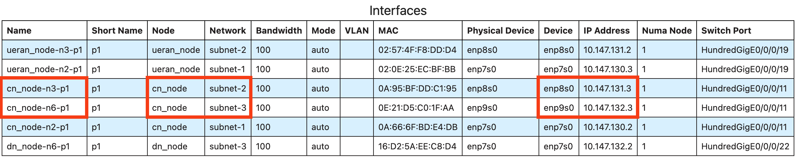


> **N3/N6 IP addresses on UERAN/DN node:** You can find the corresponding **N3** and **N6** IP addresses by checking the FABRIC configuration output table: in the **Interfaces** section, look for the row whose **Name** matches the UERAN node's N3 interface (`ueran_node-n3-p1`) and  DN node's N6 interface (`dn_node-n6-p1`), and then copy the value from the **IP Address** column. 

In the example shown in [Example FABRIC Network and Interface Configuration](#example-fabric-network-and-interface-configuration), the **N3 IP address** of the UERAN node is `10.147.131.2` and the **N6 IP address** of the DN node is `10.147.132.2`.
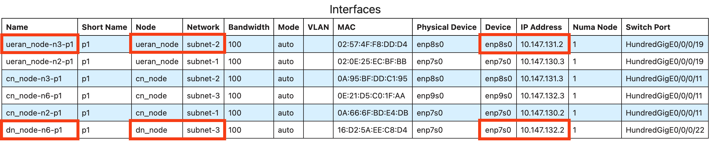

The configuration file should look like this (based on the example shown in [Example FABRIC Network and Interface Configuration](#example-fabric-network-and-interface-configuration)):

```yaml
info:
  version: 1.0.0
  description: L25GC+ UPF-U Configuration

configuration:
  log_level: "warning" # trace, debug, info, warning, error, fatal, panic
  dataplane:
    upf_n3_ip: "{IP of cn_node-n3-p1}"         # N3 interface IP address on the Core Network node
    upf_n6_ip: "{IP of cn_node-n6-p1}"         # N6 interface IP address on the Core Network node
    an_peer_n3_ip: "{IP of ueran_node-n3-p1}"  # N3 interface IP address on the UE/RAN node
    dn_peer_n6_ip: "{IP of dn_node-n6-p1}".    # N6 interface IP address on the DN node

    ports:
      n3_port: 0                     # NIC port used for N3 interface
      n6_port: 1                     # NIC port used for N6 interface
```

Make sure that all of these values match the actual interface IP addresses in your FABRIC cluster.

> **Note:** In the current implementation, `an_peer_n3_ip` and `dn_peer_n6_ip` must be set manually. We plan to improve this in a future revision so that these peer IP addresses no longer need to be configured explicitly.

### Step-6: Provision UE Subscription Data in the CN's Database
> Next, we need to use the WebConsole (adapted from free5GC) to provision UE subscription data in the CN's database. It provides the necessary subscriber information that enables L25GC+ to authenticate the UE and establish services correctly during PDU Session Establishment.

If your web console service is running on the FABRIC CN node (for example on port **5000**), the recommended way to access it from your laptop is to use **SSH local port forwarding**.

#### Customize for your FABRIC SSH command
The SSH command below includes **example values**. On your setup, the following fields will likely be different:

* **SSH private key path** (example: `.ssh/fabric_keys/slice_key`)
* **FABRIC SSH config file path** (example: `.ssh/fabric_ssh_config`)
* **CN node address** (IPv6) and sometimes the **username**

#### Option A: Forward `localhost:5000` → CN `localhost:5000`
Open a new terminal on your **laptop** and run the following command  (replace the values above with your own):

```bash
ssh -N \
  -i .ssh/fabric_keys/slice_key \
  -F .ssh/fabric_ssh_config \
  -L 5000:127.0.0.1:5000 \
  ubuntu@<CN_NODE_ADDRESS>
```

Then open in your laptop browser:

* `http://localhost:5000`

#### Option B: Use a different local port (recommended if 5000 is occupied)

If port 5000 on your laptop is already in use, map a different local port (e.g., **15000 → 5000**):

```bash
ssh -N \
  -i .ssh/fabric_keys/slice_key \
  -F .ssh/fabric_ssh_config \
  -L 15000:127.0.0.1:5000 \
  ubuntu@<CN_NODE_ADDRESS>
```

Then browse:

* `http://localhost:15000`

---

## 2. Log into the UE/RAN node and Setup Environment
Open **a new terminal** and SSH into your assigned UE/RAN node.

After you log in, run these commands in the terminal.

### Clone L25GC+ Repository
```bash
cd ~/
git clone https://github.com/nycu-ucr/L25GC-plus.git
```

### Step-1: Run the setup script to install UERANsim and OAI UE/RAN
```bash
cd ~/L25GC-plus/
yes y | ./scripts/setup.sh ue
```

### Step-2: Add the L3 Route to DN server
> Since the UE and DN are in different L3 subnets, both the UERAN node and the DN node need static routes so that traffic is forwarded through the UPF-U.

On the UERAN node, add a route so that traffic destined for the DN server is sent through the UPF-U's N3 interface:
```bash
# On the UERAN node:
sudo ip route add <IP of dn_node-n6-p1> via <IP of cn_node-n3-p1> dev <Device of ueran_node-n3-p1>
```

You can find these values directly from the FABRIC **Interfaces** table by matching the **Name** column:

* Find the row named `dn_node-n6-p1`, and use its **IP Address** as the destination IP.
* Find the row named `cn_node-n3-p1`, and use its **IP Address** as the next-hop (`via`) IP.
* Find the row named `ueran_node-n3-p1`, and use its **Device** as the outgoing interface (`dev`).

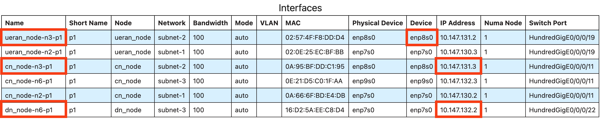

In the example shown in [Example FABRIC Network and Interface Configuration](#example-fabric-network-and-interface-configuration):

* `dn_node-n6-p1` → `IP Address = 10.147.132.2`
* `cn_node-n3-p1` → `IP Address = 10.147.131.3`
* `ueran_node-n3-p1` → `Device = enp8s0`

So the route becomes:

```bash
sudo ip route add 10.147.132.2 via 10.147.131.3 dev enp8s0
```

### Step-3: Configure UERANsim (PDU Establishment only)
> This step updates the UERANsim gNB configuration so that the simulated gNB uses the correct **N2** and **N3** interface IP addresses and can connect to the **AMF** and **UPF-U** in the core network. These settings must match the actual network configuration of your FABRIC cluster.

The UERANsim gNB configuration file is located at:
```bash
~/L25GC-plus/UERANSIM/config/free5gc-gnb.yaml
```

Replace:

```yaml
...
  ngapIp: 127.0.0.1   # gNB's N2 Interface IP address
  gtpIp: 127.0.0.1    # gNB's N3 Interface IP address

  amfConfigs:
    - address: 127.0.0.1 # AMF's N2 interface IP address
```

with:

```yaml
...
  ngapIp: {IP of ueran_node-n2-p1}   # gNB's N2 Interface IP address
  gtpIp:  {IP of ueran_node-n3-p1}   # gNB's N3 Interface IP address

  amfConfigs:
    - address: {IP of cn_node-n2-p1}      # AMF's N2 interface IP address
```

Make sure these values match the actual interface IP addresses in your own FABRIC cluster. You can find them directly from the FABRIC **Interfaces** table by matching the **Name** column:

* `ngapIp` should be set to the **IP Address** of `ueran_node-n2-p1`, which is the gNB's **N2 interface IP**.
* `gtpIp` should be set to the **IP Address** of `ueran_node-n3-p1`, which is the gNB's **N3 interface IP**.
* `amfConfigs.address` should be set to the **IP Address** of `cn_node-n2-p1`, which is the AMF's **N2 interface IP**.

In the example shown in [Example FABRIC Network and Interface Configuration](#example-fabric-network-and-interface-configuration):

* `ueran_node-n2-p1` → `IP Address = 10.147.130.3`, so `ngapIp: 10.147.130.3`
* `ueran_node-n3-p1` → `IP Address = 10.147.131.2`, so `gtpIp: 10.147.131.2`
* `cn_node-n2-p1` → `IP Address = 10.147.130.2`, so `amfConfigs.address: 10.147.130.2`

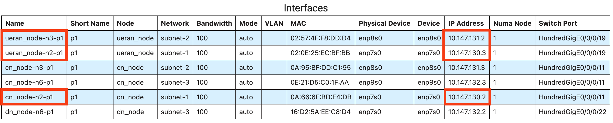

### Step-4: Configure OAI UE/RAN simulator (PDU Establishment + Handover)
> This step updates the OpenAirInterface configuration files so that the gNBs, UE, and neighboring cell settings match the current testbed environment. In particular, you will configure the PLMN and slice information, set the correct N2 and N3 IP addresses, and prepare a second gNB for the N2 handover experiment.

#### 1. Edit the first gNB configuration

We first need to edit `gnb.sa.band78.fr1.106PRB.pci0.rfsim.conf` because this file defines the gNB-side radio and network parameters used by OpenAirInterface. 

In this experiment, the gNB must be configured with the correct PLMN and slice information so that it matches the core network settings, and it must also use the correct IP addresses for the **N2** and **N3** interfaces so it can communicate with the **AMF** and **UPF-U** properly. 

Without these changes, the gNB would not be able to register to the core network or forward user traffic correctly.

Open and edit `~/L25GC-plus/openairinterface5g/targets/PROJECTS/GENERIC-NR-5GC/CONF/gnb.sa.band78.fr1.106PRB.pci0.rfsim.conf`

```bash
vim ~/L25GC-plus/openairinterface5g/targets/PROJECTS/GENERIC-NR-5GC/CONF/gnb.sa.band78.fr1.106PRB.pci0.rfsim.conf
```

In this file, update the following three sections.

##### (a) Update `plmn_list` in the `gNBs` entry
```bash
    plmn_list = ({ mcc = 208; mnc = 93; mnc_length = 2; snssaiList = ({ sst = 0x01; sd = 0x010203; }) });
```

##### (b) Set `amf_ip_address` to the AMF's N2 interface IP address (IP of `cn_node-n2-p1`)
```bash
    ////////// AMF parameters:
    amf_ip_address = ({ ipv4 = "IP of cn_node-n2-p1"; });
```

##### (c) Set the gNB's N2 and N3 interface IP addresses in `NETWORK_INTERFACES`
```bash
    NETWORK_INTERFACES :
    {
        GNB_IPV4_ADDRESS_FOR_NG_AMF              = "IP of ueran_node-n2-p1";
        GNB_IPV4_ADDRESS_FOR_NGU                 = "IP of ueran_node-n3-p1";
        GNB_PORT_FOR_S1U                         = 2152; # Spec 2152
    };
```
`GNB_IPV4_ADDRESS_FOR_NG_AMF` should be the **gNB's N2 address** (`ueran_node-n2-p1`), and `GNB_IPV4_ADDRESS_FOR_NGU` should be the **gNB's N3 address** (`ueran_node-n3-p1`).


#### 2. Add IP addresses for the second gNB
Since the experiment performs an N2 handover, a **second gNB** is required. 
Assign one additional N2 IP address and one additional N3 IP address for the second gNB. For example:
```bash
# N2 interface
sudo ip a add <Select an unused IP in the Subnet-1> dev <Device of ueran_node-n2-p1>

# N3 interface
sudo ip a add <Select an unused IP in the Subnet-2> dev <Device of ueran_node-n3-p1>
```

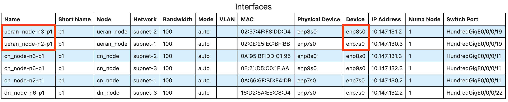

Next, open and edit `~/L25GC-plus/openairinterface5g/targets/PROJECTS/GENERIC-NR-5GC/CONF/gnb.sa.band78.fr1.106PRB.pci1.rfsim.conf` using the same steps as above.

```bash
vim ~/L25GC-plus/openairinterface5g/targets/PROJECTS/GENERIC-NR-5GC/CONF/gnb.sa.band78.fr1.106PRB.pci1.rfsim.conf
```

In this file, update the following three sections.

##### (a) Update `plmn_list` in the `gNBs` entry
```bash
    plmn_list = ({ mcc = 208; mnc = 93; mnc_length = 2; snssaiList = ({ sst = 0x01; sd = 0x010203; }) });
```

##### (b) Set `amf_ip_address` to the AMF's N2 interface IP address (IP of `cn_node-n2-p1`)
```bash
    ////////// AMF parameters:
    amf_ip_address = ({ ipv4 = "IP of cn_node-n2-p1"; });
```

##### (c) Set the gNB's N2 and N3 interface IP addresses in `NETWORK_INTERFACES`
```bash
    NETWORK_INTERFACES :
    {
        GNB_IPV4_ADDRESS_FOR_NG_AMF              = "IP address of second gNB's N2";
        GNB_IPV4_ADDRESS_FOR_NGU                 = "IP address of second gNB's N3";
        GNB_PORT_FOR_S1U                         = 2152; # Spec 2152
    };
```

Make sure that:
- `amf_ip_address` is still set to the **AMF's N2 interface IP address** (`cn_node-n2-p1`)
- `GNB_IPV4_ADDRESS_FOR_NG_AMF` is set to the **second gNB's** N2 address
- `GNB_IPV4_ADDRESS_FOR_NGU` is set to the **second gNB's** N3 address


#### 3. Edit the neighbor cell configuration
Now edit `~/L25GC-plus/openairinterface5g/targets/PROJECTS/GENERIC-NR-5GC/CONF/neighbour-config-rfsim.conf`
```bash
vim targets/PROJECTS/GENERIC-NR-5GC/CONF/neighbour-config-rfsim.conf
```

Inside `neighbour_list`, there are **two** `neighbour_cell_configuration` entries. Update the `plmn` field in both entries as follows:
```bash
        plmn                = { mcc = 208; mnc = 93; mnc_length = 2 };
```

##### 4. Edit the UE UICC configuration
Finally, edit `uicc0` in `~/L25GC-plus/openairinterface5g/ci-scripts/conf_files/nrue.uicc.conf`:
```bash
uicc0 = {
  imsi = "208930000000001";
  key = "8baf473f2f8fd09487cccbd7097c6862";
  opc= "8e27b6af0e692e750f32667a3b14605d";
  pdu_sessions = ({ dnn = "internet"; nssai_sst = 0x01; nssai_sd = 0x010203; });
}
```

## 3. Log into the DN node and Setup Environment
Open **a new terminal** and SSH into your assigned DN node.

After you log in, run these commands in the terminal.

### Clone L25GC+ Repository
```bash
cd ~/
git clone https://github.com/nycu-ucr/L25GC-plus.git
```

### Step-1: Run the setup script to install iperf3
```bash
cd ~/L25GC-plus/
yes y | ./scripts/setup.sh dn
```

### Step-2: Add the L3 Route to UE
> Since the UE and DN are in different L3 subnets, both the UERAN node and the DN node need static routes so that traffic is forwarded through the UPF-U.

On the DN node, add a route so that reply traffic to the UE IP is sent through the UPF-U N6 interface.

In this tutorial, the UE is assigned the default IP address `10.60.0.1`. If your setup uses a different UE IP, replace `10.60.0.1` accordingly. Note that `10.60.0.1` is not taken from the FABRIC interface table; it is the UE IP defined by the tutorial configuration.

```bash
# On the DN node:
sudo ip route add 10.60.0.1 via <IP of cn_node-n6-p1> dev <Device of dn_node-n6-p1>
```

You can find these values directly from the FABRIC **Interfaces** table by matching the **Name** column:

* Find the row named `cn_node-n6-p1`, and use its **IP Address** as the next-hop (`via`) IP.
* Find the row named `dn_node-n6-p1`, and use its **Device** as the outgoing interface (`dev`).

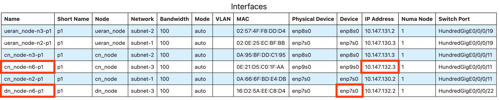

In the example shown in [Example FABRIC Network and Interface Configuration](#example-fabric-network-and-interface-configuration):

* `cn_node-n6-p1` → `IP Address = 10.147.132.3`
* `dn_node-n6-p1` → `Device = enp7s0`

So the route becomes:

```bash
sudo ip route add 10.60.0.1 via 10.147.132.3 dev enp7s0
```

---

## 3. Testing L25GC+ with UERANsim (PDU Session Establishment, ping, iperf3)

> In this experiment, we will bring up all NFs for L25GC+ on the CN node. Then we will bring up the UERANsim's gNB and UE on the UERAN node. We will next test the connectivity between the UERAN node and DN node via ping. We will finally do the throughput test between the UE (iperf3 client) and the DN server (iperf3 server).

---

## 4. Testing L25GC+ with OAI UE/RAN (PDU Session Establishment + Handover)

### Startup Order

Services on the CN node must be started in this order:

1. **ONVM Manager** — wait until port info is printed
2. **UPF-U** — wait for "NF_READY" message
3. **UPF-C** — wait for "NF_READY" message
4. **CP NFs** (`run_cp_nfs.sh`) — wait for "All NFs started"
5. **Webconsole** - only need to be run once, please refer to [this](https://github.com/nycu-ucr/L25GC-plus/tree/main/docs/fabric_testbed#5-access-the-cn-web-console-from-your-laptop-ssh-tunnel).

⚠️ OAI gNB does not support multiple slice rules, please edit and remove rules make subscribers as follow image.

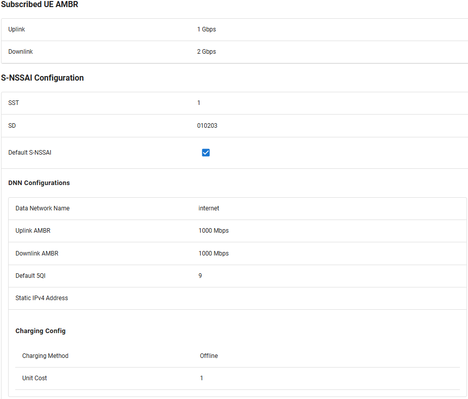

Startup command please refer to:
* [Running L25GC+](https://github.com/nycu-ucr/L25GC-plus/tree/main/README.md#running-l25gc)

Then on Node1 (UERAN):

6. **gNB**:
```bash
cd ~/L25GC-plus/openairinterface5g/cmake_targets/ran_build/build
sudo ./nr-softmodem -O ../../../targets/PROJECTS/GENERIC-NR-5GC/CONF/gnb.sa.band78.fr1.106PRB.pci0.rfsim.conf --telnetsrv --telnetsrv.shrmod ci --gNBs.[0].min_rxtxtime 6 --rfsim --rfsimulator.[0].serveraddr 127.0.0.1
```
Log should shows "Received NGSetupResponse from AMF".

7. **UE**:
```bash
cd ~/L25GC-plus/openairinterface5g/cmake_targets/ran_build/build
sudo ./nr-uesoftmodem -r 106 --numerology 1 --band 78 -C 3619200000 --rfsim --uicc0.imsi 208930000000001 -O ../../../ci-scripts/conf_files/nrue.uicc.conf --rfsimulator.[0].serveraddr server
```
Log should shows "PDU Session establishment successful".

Use `ip a` to check whether the tunnel `oaitun_ue1` presented, if it exists, pdu session setup is success!✅

### Handover experiment

Continue with previous experiment, open another terminal on node 1 (UE/RAN) and start second gNB.
```bash
cd ~/L25GC-plus/openairinterface5g/cmake_targets/ran_build/build
sudo ./nr-softmodem -O ../../../targets/PROJECTS/GENERIC-NR-5GC/CONF/gnb.sa.band78.fr1.106PRB.pci1.rfsim.conf   --rfsim --telnetsrv --telnetsrv.shrmod ci   --telnetsrv.listenport 9091   --gNBs.[0].min_rxtxtime 6   --rfsimulator.[0].serveraddr 127.0.0.1
```
On fourth terminal set oaitun_ue1 MTU
```bash
sudo ifconfig oaitun_ue1 mtu 1350
```
Then, start iperf3 on ue and dn node to observe throughput before and after handover.
```bash
# On UE/RAN Node:
iperf3 -c 192.168.2.2 -B 10.60.0.1
```
```bash
# On DN Node:
iperf3 -s -B 192.168.2.2
```
Replace `192.168.2.2` with the IP of your DN node. Assume 10.60.0.1 is the IP of UE (oaitun_ue1).

Open a fifth terminal to trigger N2 handover,
```bash
echo ci trigger_n2_ho 1,1 | nc 127.0.0.1 9090 && echo
```
If you can see traffic on second gNB and iperf3 throughput drop to 0 and recover back, then 
handover is success!✅