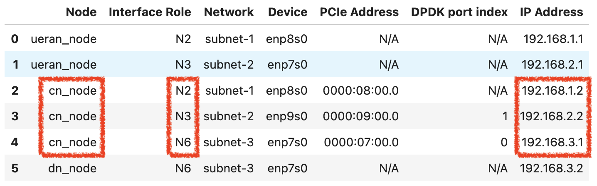

## L25GC+ Tutorial: An Open-Source Low-Latency 5G Core and Its Deployment as "Core-as-a-Service" on the NSF FABRIC Testbed

This tutorial introduces L25GC+, an open-source, low-latency 5G core, and provides a practical path from system concepts to hands-on experimentation. We first highlight key control-plane bottlenecks in existing 3GPP-compliant 5G cores and explain the design choices made by L25GC+. We then present OpenNetVM, a DPDK-based high-performance NFV platform that serves as the foundation for L25GC+'s data plane, and share lessons learned from building and optimizing L25GC+ on top of it. Finally, we demonstrate how to access L25GC+ as a "core service" on NSF FABRIC and use it to accelerate reproducible 5G experiments. This tutorial is intended for users who want to quickly evaluate and experiment with a L25GC+ core without managing the full deployment stack.

> Intended audience: new users, advanced users who also want to use the "core as a service" and researchers in cellular networks.

---

### Tutorial Overview

In this tutorial, you do **not** need to install or deploy **L25GC+** from scratch.
We will prepare and configure the **Core Network (CN) node** as a service for you in advance.

The goal of this tutorial is to help you run a **UERANSIM-based experiment** on top of **L25GC+**. To support this, we will provide you with the key IP addresses of L25GC+, including the IPs used for the **N2**, **N3**, and **N6** interfaces.

The experimental testbed consists of three nodes:

* a **UE/RAN node**
* a **Core Network (CN) node**
* a **Data Network (DN) node**

These nodes are connected through three separate subnets:

* **subnet-1**: used for the **N2** interface between the UE/RAN and the control-plane network functions in the 5G core
* **subnet-2**: used for the **N3** interface between the UE/RAN and the **UPF-U**
* **subnet-3**: used for the **N6** interface between the **UPF-U** and the Data Network


The table below shows the interface mapping and IP assignment of the three-node cluster. In particular, you will need the **CN node’s N2, N3, and N6 IP addresses** during the later configuration steps. These IP addresses are highlighted in red in the figure below.



From this table, you can identify the following CN-side IP addresses:

* **N2 IP**: `192.168.1.2`
* **N3 IP**: `192.168.2.2`
* **N6 IP**: `192.168.3.1`

You will use these IP addresses later when configuring **UERANSIM** and validating connectivity between the UE/RAN node, the core network, and the DN node.

Since the **CN node is already configured and running**, you only need to work on the assigned **UE/RAN node** and **DN node**. After logging into these nodes via SSH, you will follow the instructions in this document to install the required software, update the necessary configurations, and complete the tutorial experiments.

Please use **only the servers assigned to your group**. These resources are reserved specifically for the tutorial session. If you would like to continue using them after the tutorial, please contact us first.

---

### Assigned Servers

Here is the server information we will be using:

**Group A:**
```bash
# Slice name: L25GC-1cde01d7
ubuntu@2001:400:a100:3010:f816:3eff:fe6f:f182 # (UE/RAN node) @ SALT
ubuntu@2001:400:a100:3010:f816:3eff:fe90:9d65 # (Data Network node) @ SALT
```

**Group B:**
```bash
# Slice name: L25GC-e974aa0d
ubuntu@2001:400:a100:3050:f816:3eff:fec8:5f50 # (UE/RAN node) @ ATLA
ubuntu@2001:400:a100:3050:f816:3eff:fe71:29e3 # (Data Network node) @ ATLA
```

**Group C:**
```bash
# Slice name: L25GC-8a4d46da
ubuntu@2607:f018:110:11:f816:3eff:fef7:d57c # (UE/RAN node) @ MICH
ubuntu@2607:f018:110:11:f816:3eff:fe7e:e127 # (Data Network node) @ MICH
```

You will be assigned a specific group at the beginning of the tutorial.

Access assigned nodes using:

```bash
ssh -i <path_to_private_key> -F <path_to_fabric_ssh_config> ubuntu@<node_address>

# Example (if you use the built-in terminal on JupyterHub):
# ssh -i /home/fabric/work/fabric_config/slice_key -F /home/fabric/work/fabric_config/ssh_config ubuntu@<node_address>
```

Where:

- `<path_to_private_key>` is the path to your private SSH key (corresponding to a key registered in FABRIC Portal)
- `<path_to_fabric_ssh_config>` is the path to your FABRIC SSH config file (typically ~/.ssh/config or a FABRIC-specific config)
- `<node_address>` is the server IP shown above

---

### Step-1: Log into the UE/RAN node and Setup Environment
Open **a new terminal** and SSH into your assigned UE/RAN node.

After you log in, run these commands in the terminal.

#### (1) Add the L3 Route to DN server
> Since the UE and DN are in different L3 subnets, both the UERAN node and the DN node need static routes so that traffic is forwarded through the UPF-U.

On the **UERAN node**, add a route so that traffic destined for the DN server is sent through the **UPF-U's N3 interface**:
```bash
sudo ip route add 192.168.3.2 via 192.168.2.2
```

Specifically:

* use the **DN node N6 IP** (`192.168.3.2`) as the destination IP
* use the **CN node N3 IP** (`192.168.2.2`) as the next-hop (`via`) IP

#### (2) Configure UERANsim
> This step updates the UERANsim gNB configuration so that the simulated gNB uses the correct **N2** and **N3** interface IP addresses and can connect to the **AMF** and **UPF-U** in the core network. These settings must match the actual network configuration of your assigned cluster.

The UERANsim gNB configuration file is located at:
```bash
~/L25GC-plus/UERANSIM/config/free5gc-gnb.yaml
```

Replace:

```yaml
...
ngapIp: 127.0.0.1   # gNB's N2 Interface IP address
gtpIp: 127.0.0.1    # gNB's N3 Interface IP address

amfConfigs:
  - address: 127.0.0.1 # AMF's N2 interface IP address
```

with:

```yaml
...
ngapIp: 192.168.1.1      # gNB's N2 Interface IP address
gtpIp:  192.168.2.1      # gNB's N3 Interface IP address

amfConfigs:
  - address: 192.168.1.2 # AMF's N2 interface IP address
```

---

### Step-2: Log into the DN node and Setup Environment
Open **a new terminal** and SSH into your assigned DN node.

After you log in, run these commands in the terminal.

#### (1) Add the L3 Route to UE
> Since the UE and DN are in different L3 subnets, both the UERAN node and the DN node need static routes so that traffic is forwarded through the UPF-U.

On the **DN node**, add a route so that reply traffic to the UE IP is sent through the UPF-U N6 interface.

```bash
sudo ip route add 10.60.0.1 via 192.168.3.1
```

> In this tutorial, the UE is assigned the default IP address `10.60.0.1`.

---

### Step-3: Testing L25GC+ with UERANsim (PDU Session Establishment, ping, iperf3)

> In this experiment, you will bring up the UERANsim's gNB and UE on the UERAN node. You will next test the connectivity between the UERAN node and DN node via ping. You will finally do the throughput test between the UE (iperf3 client) and the DN server (iperf3 server).

**Note:** The following experiments will require multiple terminal sessions. If you are familiar with a terminal multiplexer such as **tmux** or **byobu**, using one will make the workflow much easier. Otherwise, you can simply open multiple terminal windows manually.  

For each step, we will clearly state how many terminals you need. Please pay close attention to those instructions before proceeding.

#### (1) Log in to the UE/RAN node and run UERANSIM

After L25GC+ has been started on the CN node, open **two new terminals** and SSH into your assigned **UE/RAN node** in both of them.

In this step, you will use these two terminals to start the UERANSIM components in the following order:

- **Terminal 1:** gNB
- **Terminal 2:** UE

Please start the **gNB first**, and then start the **UE**.

During this process, the UE will attach to the gNB and register with L25GC+, which will trigger **UE registration** and **PDU session establishment**.

1. **Terminal 1: Run gNB**
    ```bash
    cd ~/L25GC-plus/UERANSIM
    sudo ./build/nr-gnb -c config/free5gc-gnb.yaml
    ```

2. **Terminal 2: Run UE**
    ```bash
    cd ~/L25GC-plus/UERANSIM
    sudo ./build/nr-ue -c config/free5gc-ue.yaml
    ```

> After the PDU session establishment is complete, UERANSIM will create a UE endpoint interface in the UE/RAN node's network stack. The interface is named `uesimtun0` and has the IP address `10.60.0.1`. This is the UE-side interface that will be used in the following connectivity and traffic experiments.

#### (2) Ping test between the UE and the DN server

Open **one new terminal** and SSH into your **UE/RAN node**.

After the PDU session has been established, run the following command to test connectivity from the UE endpoint `uesimtun0` to the DN server:

```bash
ping -I uesimtun0 192.168.3.2
```
> Note: In our FABRIC artifact, `192.168.3.2` is the default IP address of the N6 interface on the DN node.

After verifying that the ping succeeds, press `Ctrl+C` to stop the ping test, and then proceed to the `iperf3` throughput test.


#### (3) `iperf3` throughput test between the UE and the DN server

Open **two new terminals**:

- **Terminal 1:** SSH into the **DN node** and run the `iperf3` server
- **Terminal 2:** SSH into the **UE/RAN node** and run the `iperf3` client

First, start the `iperf3` server on the **DN node**:

```bash
iperf3 -s -B 192.168.3.2
````

Then, in the other terminal, run the `iperf3` client on the **UE/RAN node**:

```bash
iperf3 -c 192.168.3.2 -B 10.60.0.1
```

> In this test, `192.168.3.2` is the default **DN N6 IP address** used by our FABRIC artifact, and `10.60.0.1` is the IP address of the UE interface `uesimtun0` created by UERANSIM after PDU session establishment.