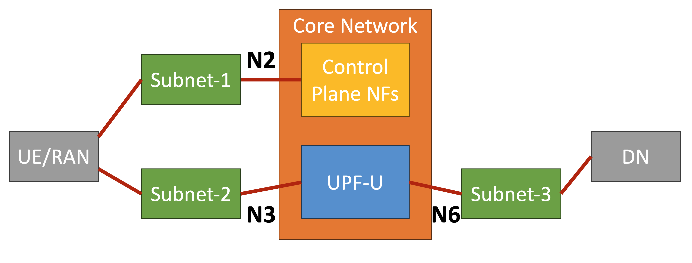
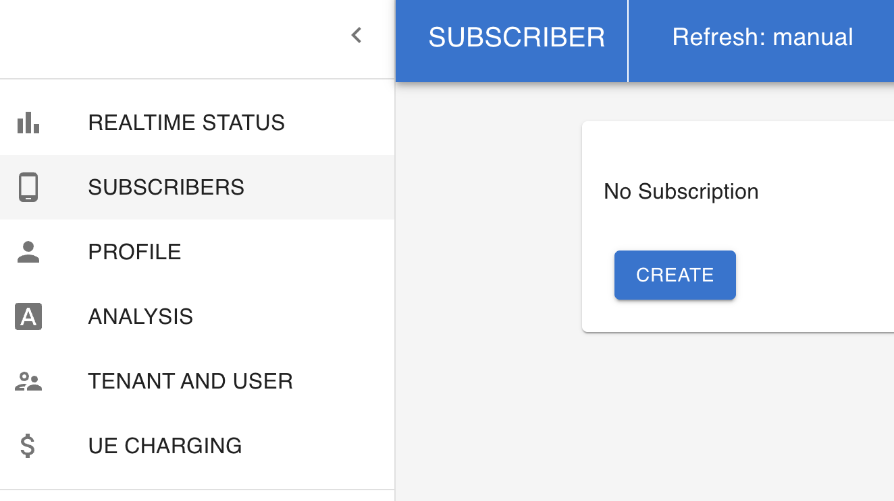
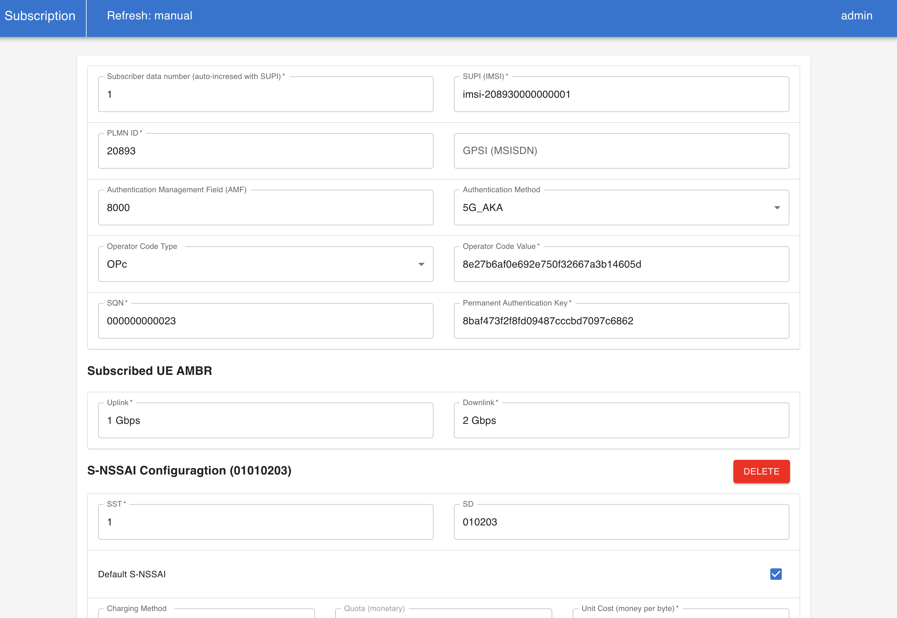
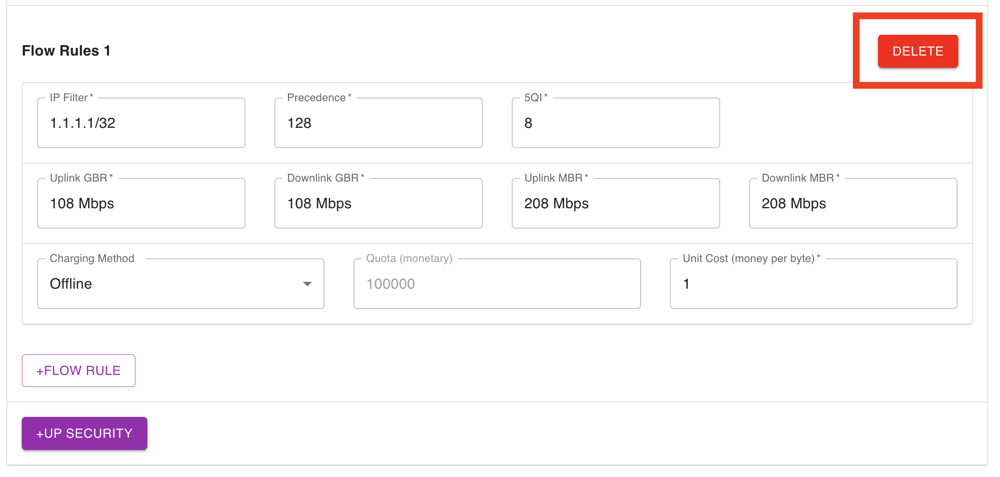
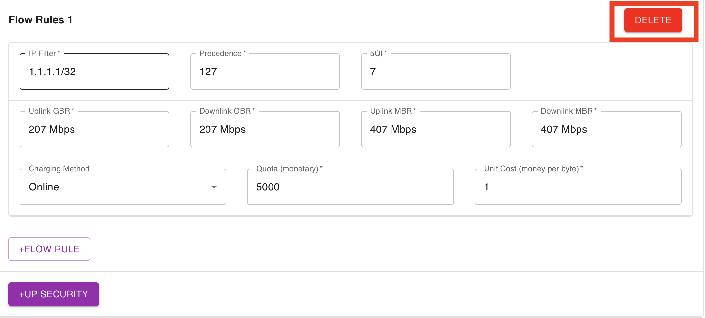
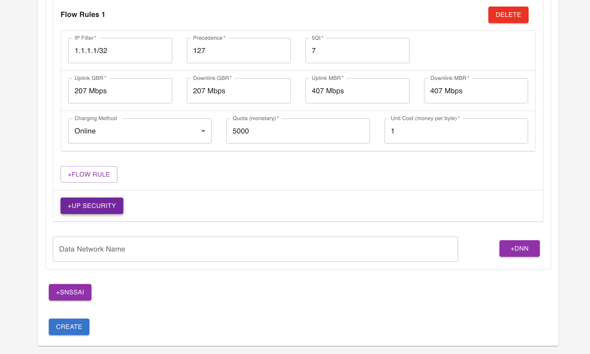
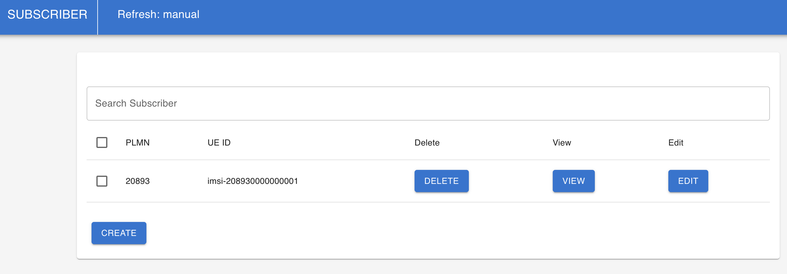
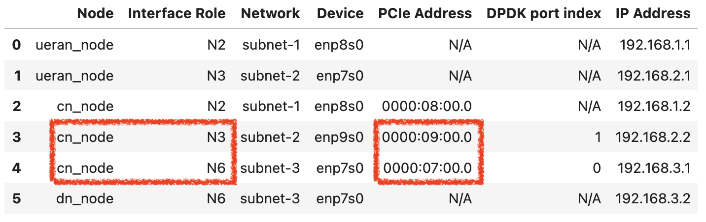

## Deploying L25GC+ on NSF FABRIC: Cluster Provisioning, Build, and Installation Tutorial

This tutorial provides a deployment-focused, end-to-end guide to running L25GC+ on NSF FABRIC for users who want full control over configuration and code. Participants will learn how to provision and manage a FABRIC cluster for L25GC+. We then walk through building the complete software stack—compiling dependencies, compiling and installing L25GC+. This tutorial is intended for researchers who plan to self-deploy L25GC+ for customized experiments, performance tuning, or development.

> Intended audience: advanced users, and researchers in cellular networks, people who attend Tutorial 1 and want more information to deploy dedicated core instance for experiments.

---

### Topology Setup
The experimental testbed consists of a UE/RAN node, a Core Network (CN) node, and a Data Network (DN) node, connected through three separate subnets. `subnet-1` is used for the N2 interface between the UE/RAN and the control-plane NFs in the 5G core. `subnet-2` is used for the N3 interface between the UE/RAN and the UPF-U. `subnet-3` is used for the N6 interface between the UPF-U and the DN.



---

### Step-0: Create and Configure Your FABRIC Cluster

Before starting the tutorial, please create your own FABRIC cluster using our artifact:

**L25GC+ FABRIC Artifact:**
[https://artifacts.fabric-testbed.net/artifacts/078e8c8d-eb8d-4279-b711-85fb217a7db7](https://artifacts.fabric-testbed.net/artifacts/078e8c8d-eb8d-4279-b711-85fb217a7db7)

The artifact helps you:

- create a three-node L25GC+ cluster on FABRIC (UE/RAN, Core Network, and Data Network);
- build and submit the required topology, including the inter-node networks for N2, N3, and N6 connectivity;
- provision the nodes and configure their network interfaces automatically;
- assign IP addresses and set up the routing needed by the experiment;
- install the required software stack on each node;
- configure key L25GC+ components, including AMF, SMF, and UPF-U, using the generated network settings;
- configure UERANSIM and OAI-based UE/RAN components for PDU session establishment, handover, and end-to-end traffic experiments.

Please complete the artifact setup first, then continue with the rest of the tutorial steps on your own FABRIC cluster.

---

### Step-1: Provision UE Subscription Data in the CN's Database
> Next, we need to use the WebConsole (adapted from free5GC) to provision UE subscription data in the CN's database (MongoDB). It provides the necessary subscriber information that enables L25GC+ to authenticate the UE and establish services correctly during PDU Session Establishment.

Open **a new terminal** and SSH into your assigned Core Network node.

After you log in, run these commands in the terminal.

#### Run Webconsole server on the CN node
```bash
cd ~/L25GC-plus/webconsole/ 
./bin/webconsole
```

#### Access the Webconsole from your laptop browser
After the Webconsole service is running on the CN node, you can access it from your laptop browser by enabling **SSH local port forwarding**.

Open **a new terminal on your laptop** and run the following command to set up **SSH local port forwarding**. See the **example** below. On your setup, the following fields will likely be different, so replace them with your own values:

* **SSH private key path** (example: `.ssh/fabric_keys/slice_key`)
* **FABRIC SSH config file path** (example: `.ssh/fabric_ssh_config`)
* **CN node address**

```bash
ssh -N \
  -i .ssh/fabric_keys/slice_key \
  -F .ssh/fabric_ssh_config \
  -L 5000:127.0.0.1:5000 \
  ubuntu@<CN_NODE_ADDRESS>
```

Then open in your laptop browser:

* `http://localhost:5000`

> If port 5000 on your laptop is already in use, map a different local port (e.g., **15000 → 5000**).

> If, during the tutorial, you find that your laptop does not have the required FABRIC SSH key/configuration set up, you may temporarily add the instructor’s FABRIC public key to `~/.ssh/authorized_keys` on your CN node so that the instructor can log in remotely and help you complete the WebConsole setup.

Instructor FABRIC public key:
```bash
ecdsa-sha2-nistp256 AAAAE2VjZHNhLXNoYTItbmlzdHAyNTYAAAAIbmlzdHAyNTYAAABBBGbU/IhIb8EF9YFVpEgOpdjhOKES46KwOScKqbYdH9ddypzW84NJGTqKERDY7vOz60IAAOXkalYswCrfkhaQL7o= slice_key%
```

#### Provision UE Subscription Data
Then follow the steps below to provision the UE subscription data.

##### (1) Log in to the Webconsole
Open the Webconsole in your browser.

Use the following default credentials:

- **Username:** `admin`
- **Password:** `free5gc`

<p align="center">
  
</p>

##### (2) Go to **SUBSCRIBERS**
After logging in, use the left sidebar and click **SUBSCRIBERS**.

If no subscriber has been created yet, you will see a page showing **No Subscription**.  
Click **CREATE** to add a new UE subscriber.

<p align="center">
  
</p>

##### (3) Remove the default flow rules
You will be taken to the subscriber creation page.

Most fields are already pre-filled for this tutorial, but you need to make one manual change.

<p align="center">
  
</p>

Each subscriber includes two slices by default, and each slice contains a **Flow Rule**.  
Since the later experiments use **OAI gNB**, and **OAI gNB does not support multiple slice rules**, you need to remove the default flow rule(s) before creating the subscriber.

In the **Flow Rules** section, click the red **DELETE** button at the upper-right corner of the rule panel to remove the rule.

<p align="center">
  
</p>

Do the same for the 2nd slice.

<p align="center">
  
</p>

Then scroll to the bottom of the page and click **CREATE**.

##### (4) Create the subscriber
At the bottom of the page, click **CREATE** to create the UE subscription.

<p align="center">
  
</p>

##### (5) Confirm the creation
After the subscriber is created successfully, the Webconsole will return to the subscriber list page, where you should see the new subscriber entry.

<p align="center">
  
</p>

> At this point, you can close the Webconsole in your browser and terminate the SSH local port forwarding session, since it will not be needed for the rest of the tutorial.

---

### Step-2: Testing L25GC+ with UERANsim
> In this experiment, we will first bring up all NFs of L25GC+ on the CN node. Then we will start the UERANSIM gNB and UE on the UERAN node to trigger UE registration and PDU session establishment. Next, we will test connectivity between the UERAN node and the DN node using ping. Finally, we will run a throughput test between the UE (as the iperf3 client) and the DN server (as the iperf3 server).

**Note:** The following experiments will require multiple terminal sessions. If you are familiar with a terminal multiplexer such as **tmux** or **byobu**, using one will make the workflow much easier. Otherwise, you can simply open multiple terminal windows manually.  

For each step, we will clearly state how many terminals you need. Please pay close attention to those instructions before proceeding.

#### (1) Log in to the Core Network node and start L25GC+

Open **four new terminals** and SSH into your **Core Network (CN) node** in all of them.

In this step, you will use these four terminals to start the main L25GC+ components on the CN node:

- **Terminal 1:** ONVM Manager
- **Terminal 2:** UPF-U
- **Terminal 3:** UPF-C
- **Terminal 4:** Remaining control-plane NFs

Before starting the ONVM Manager, you need to identify the PCIe addresses of the **N3** and **N6** interfaces on your **CN node**.

During slice creation, the artifact prints an **interface summary table**. Please look at the interface summary table for **your own slice**, find the rows corresponding to:

- **cn_node, N3**
- **cn_node, N6**

and copy their **PCIe Address** values.

An example is shown below:

<p align="center">
  
</p>

In this example:
- the **N3** interface PCIe address is `0000:09:00.0`
- the **N6** interface PCIe address is `0000:07:00.0`

Replace `N3_IF_PCIE` and `N6_IF_PCIE` in the ONVM Manager command below with the PCIe addresses from **your own** interface summary table.

1. **Terminal 1: Run ONVM Manager**
    ```bash
    cd ~/L25GC-plus/
    ./scripts/run/run_onvm_mgr.sh -a "<N3_IF_PCIE> <N6_IF_PCIE>"
    ```

2. **Terminal 2: Run UPF-U**
    ```bash
    cd ~/L25GC-plus/
    ./scripts/run/run_upf_u.sh 1 ./NFs/onvm-upf/5gc/upf_u/config/upf_u.yaml
    ```

3. **Terminal 3: Run UPF-C**
    ```bash
    cd ~/L25GC-plus/
    ./scripts/run/run_upf_c.sh 2 ./NFs/onvm-upf/5gc/upf_c/config/upfcfg.yaml
    ```

4. **Terminal 4: Run the remaining control-plane NFs**
    ```bash
    cd ~/L25GC-plus/
    source ~/.bashrc
    ./scripts/run/run_cp_nfs.sh && reset && tail -f log/*.log
    ```

#### (2) Log in to the UE/RAN node and run UERANSIM

After L25GC+ has been started on the CN node, open **two new terminals** and SSH into your assigned **UE/RAN node** in both of them.

In this step, you will use these two terminals to start the UERANSIM components in the following order:

- **Terminal 1:** gNB
- **Terminal 2:** UE

Please start the **gNB first**, and then start the **UE**.

During this process, the UE will attach to the gNB and register with L25GC+, which will trigger **UE registration** and **PDU session establishment**.

1. **Terminal 1: Run gNB**
    ```bash
    cd ~/L25GC-plus/UERANSIM
    sudo ./build/nr-gnb -c config/free5gc-gnb.yaml
    ```

2. **Terminal 2: Run UE**
    ```bash
    cd ~/L25GC-plus/UERANSIM
    sudo ./build/nr-ue -c config/free5gc-ue.yaml
    ```

> After the PDU session establishment is complete, UERANSIM will create a UE endpoint interface in the UE/RAN node's network stack. The interface is named `uesimtun0` and has the IP address `10.60.0.1`. This is the UE-side interface that will be used in the following connectivity and traffic experiments.

#### (3) Ping test between the UE and the DN server

Open **one new terminal** and SSH into your **UE/RAN node**.

After the PDU session has been established, run the following command to test connectivity from the UE endpoint `uesimtun0` to the DN server:

```bash
ping -I uesimtun0 192.168.3.2
```
> Note: In our FABRIC artifact, `192.168.3.2` is the default IP address of the N6 interface on the DN node.

After verifying that the ping succeeds, press `Ctrl+C` to stop the ping test, and then proceed to the `iperf3` throughput test.


#### (4) `iperf3` throughput test between the UE and the DN server

Open **two new terminals**:

- **Terminal 1:** SSH into the **DN node** and run the `iperf3` server
- **Terminal 2:** SSH into the **UE/RAN node** and run the `iperf3` client

First, start the `iperf3` server on the **DN node**:

```bash
iperf3 -s -B 192.168.3.2
````

Then, in the other terminal, run the `iperf3` client on the **UE/RAN node**:

```bash
iperf3 -c 192.168.3.2 -B 10.60.0.1
```

> In this test, `192.168.3.2` is the default **DN N6 IP address** used by our FABRIC artifact, and `10.60.0.1` is the IP address of the UE interface `uesimtun0` created by UERANSIM after PDU session establishment.

#### (5) Clean up

Before moving on to the OAI-based experiments, please stop the components started in this section.

##### (a) Stop L25GC+ on the CN node
Open **one new terminal**, SSH into your **CN node**, and run:

```bash
cd ~/L25GC-plus/
./scripts/run/stop_cn.sh
```

This script stops the L25GC+ components running on the CN node.

##### (b) Stop UERANSIM on the UE/RAN node

Then go back to the UE/RAN terminals where you started **UERANSIM gNB** and **UERANSIM UE**, and stop both processes by pressing `Ctrl+C` in each terminal.

After all of these components have been stopped, you can proceed to the OAI-based experiments.

---

### Step-3: Testing L25GC+ with OAI UE/RAN (PDU Session Establishment + Handover)

#### (1) Log in to the Core Network node and restart L25GC+

In this step, you need to start L25GC+ on the **CN node** again.

The procedure is the same as **[Step-2 (1)](#1-log-in-to-the-core-network-node-and-start-l25gc)**:
- open the required terminals on the **CN node**,
- start the **ONVM Manager**,
- start **UPF-U**,
- start **UPF-C**,
- and then start the remaining **control-plane NFs**.

Please complete the CN-side startup first before moving on to the OAI UE/RAN startup.

#### (2) Log in to the UE/RAN node and run OAI gNB and UE

Open **four new terminals** and SSH into your **UE/RAN node** in all of them.

In this step, you will use these terminals as follows:

- **Terminal 1:** Run the first OAI gNB (source gNB)
- **Terminal 2:** Run the OAI UE
- **Terminal 3:** Run the second OAI gNB (target gNB)
- **Terminal 4:** Correct the MTU of the UE tunnel interface

Please follow the startup order below.

**Terminal 1: Run the first OAI gNB (source)**
```bash
cd ~/L25GC-plus/openairinterface5g/cmake_targets/ran_build/build
sudo ./nr-softmodem -O ../../../targets/PROJECTS/GENERIC-NR-5GC/CONF/gnb.sa.band78.fr1.106PRB.pci0.rfsim.conf --telnetsrv --telnetsrv.shrmod ci --gNBs.[0].min_rxtxtime 6 --rfsim --rfsimulator.[0].serveraddr 127.0.0.1
```

<!-- > The log should show `Received NGSetupResponse from AMF`. -->

**Terminal 2: Run the OAI UE**

```bash
cd ~/L25GC-plus/openairinterface5g/cmake_targets/ran_build/build
sudo ./nr-uesoftmodem -r 106 --numerology 1 --band 78 -C 3619200000 --rfsim --uicc0.imsi 208930000000001 -O ../../../ci-scripts/conf_files/nrue.uicc.conf --rfsimulator.[0].serveraddr server
```

<!-- > The log should show `PDU Session establishment successful`. You can also run `ip a` to check whether the tunnel interface `oaitun_ue1` is present. If `oaitun_ue1` exists, the PDU session establishment was successful. -->

**Terminal 3: Run the second OAI gNB (target)**

```bash
cd ~/L25GC-plus/openairinterface5g/cmake_targets/ran_build/build
sudo ./nr-softmodem -O ../../../targets/PROJECTS/GENERIC-NR-5GC/CONF/gnb.sa.band78.fr1.106PRB.pci1.rfsim.conf --rfsim --telnetsrv --telnetsrv.shrmod ci --telnetsrv.listenport 9091 --gNBs.[0].min_rxtxtime 6 --rfsimulator.[0].serveraddr 127.0.0.1
```

**Terminal 4: Correct the MTU of the UE endpoint**
On the fourth terminal, set the MTU of `oaitun_ue1`:

```bash
sudo ifconfig oaitun_ue1 mtu 1350
```

#### (3) Handover experiment

To run the handover experiment, you will need:

* **one new terminal** on the **DN node** for the `iperf3` server
* **two new terminals** on the **UE/RAN node**

  * one for the `iperf3` client
  * one for triggering N2 handover

First, open **one new terminal** and SSH into the **DN node**. Then start the `iperf3` server:

**Terminal 1 (DN node): Run `iperf3` server**

```bash
iperf3 -s -B 192.168.3.2
```

Next, open **two new terminals** and SSH into the **UE/RAN node**.

In the first UE/RAN terminal, start the `iperf3` client to send traffic from the UE to the DN server:

**Terminal 2 (UE/RAN node): Run `iperf3` client**

```bash
iperf3 -c 192.168.3.2 -B 10.60.0.1 -t 1000
```

In the second UE/RAN terminal, trigger the N2 handover:

**Terminal 3 (UE/RAN node): Trigger N2 handover**

```bash
echo ci trigger_n2_ho 1,1 | nc 127.0.0.1 9090 && echo
```

> **How to verify that handover is successful:**
> After the handover is triggered, observe the `iperf3` client throughput. You should see a short throughput drop, followed by recovery. At the same time, if you watch the terminals of the first gNB and the second gNB, you should see the traffic move from the first gNB to the second gNB. This indicates that the handover has completed successfully.
