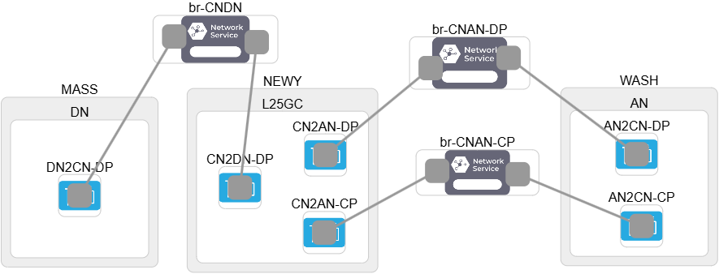

# L25GC+ on Mellanox NICs
- For the AN and DN, you can directly run the setup scripts in the L25GC-plus repository:
    ```bash
    cd ./L25GC-plus/scripts 
    ./setup.sh <ue|dn>
    ```

## L25GC+ Installation on a machine with Mellanox NICs
To install L25GC+ on a machine with Mellanox NICs, follow the steps below:

### 1. Run the setup script
- Run `./L25GC-plus/scripts/setup.sh` to install L25GC+ and essential packages on `<ue|cn|dn>`.
- Before running the script, you may need to adjust network settings in  `./L25GC-plus/scripts/set_nw_env.sh`
    ```bash
    cd ./L25GC-plus/scripts
    ./setup.sh cn
    ```

### 2. Install MLNX_OFED
- You can install the Mellanox OFED driver by following [the official documentation](https://network.nvidia.com/products/infiniband-drivers/linux/mlnx_ofed/), or by using the provided script:
    ```bash
    cd ./L25GC-plus/scripts
    ./install_ofed.sh
    ```

### 3. Build DPDK with `librte_mlx5_pmd`
- Navigate to the DPDK source directory:
    ```bash
    cd $HOME/onvm/onvm-upf/dpdk
    ```
- Modify the DPDK config file (`$HOME/onvm/onvm-upf/dpdk/config/common_base`) to enable the MLX5 PMD:
    ```diff
    --- a/config/common_base
    +++ b/config/common_base
    @@ -370,7 +370,7 @@ CONFIG_RTE_LIBRTE_MLX4_DEBUG=n
     # Compile burst-oriented Mellanox ConnectX-4, ConnectX-5,
     # ConnectX-6 & BlueField (MLX5) PMD
     #
    -CONFIG_RTE_LIBRTE_MLX5_PMD=n
    +CONFIG_RTE_LIBRTE_MLX5_PMD=y
     CONFIG_RTE_LIBRTE_MLX5_DEBUG=n
    ```
- Rebuild and install DPDK:
    ```bash
    source ~/.bashrc
    cd $HOME/onvm/onvm-upf/scripts
    ./install.sh
    ```
    
### 4. Modify and rebuild ONVM
1. Modify `$HOME/onvm/onvm-upf/onvm/onvm_mgr/onvm_init.c`
    ```diff
    --- a/onvm/onvm_mgr/onvm_init.c
    +++ b/onvm/onvm_mgr/onvm_init.c
    @@ -125,7 +125,8 @@ static const struct rte_eth_conf port_conf = {
         .rx_adv_conf = {
                 .rss_conf = {
                         .rss_key = rss_symmetric_key, .rss_hf = ETH_RSS_IP | ETH_RSS_UDP | ETH_RSS_TCP | ETH_RSS_L2_PAYLOAD,
    -                },
    +                       .rss_key_len = 40,
    +               },
             },
         .txmode = {.mq_mode = ETH_MQ_TX_NONE,
                    .offloads = (DEV_TX_OFFLOAD_IPV4_CKSUM | DEV_TX_OFFLOAD_UDP_CKSUM | DEV_TX_OFFLOAD_TCP_CKSUM)},
    ```
2. Modify `$HOME/onvm/onvm-upf/onvm/onvm_nflib/onvm_flow_table.h`
    ```diff
    --- a/onvm/onvm_nflib/onvm_flow_table.h
    +++ b/onvm/onvm_nflib/onvm_flow_table.h
    @@ -89,7 +89,7 @@ union ipv4_5tuple_host {
                     uint16_t port_src;
                     uint16_t port_dst;
             };
    -        __m128i xmm;
    +        //__m128i xmm;
     };

     struct onvm_ft *
    ```
- Rebuild ONVM
    ```
    cd $HOME/onvm/onvm-upf/onvm
    make
    ```
    
### 5. Modify ONVM scripts
- Navigate to directory
    ```bash
    cd $HOME/onvm/onvm-upf/
    ```
- Disable NIC binding check
    
    The ONVM manager startup script checks if NICs are bound to DPDK-compatible drivers. Since Mellanox NICs do not require binding, you can comment out these lines in `./onvm/go.sh`:
    ```diff
    --- a/onvm/go.sh
    +++ b/onvm/go.sh
    @@ -221,12 +221,12 @@ ports_bin="${ports_bin//0/}"
     # The number of ports is the length of the string of 1's. Using above example: 1111 -> 4
     count_ports="${#ports_bin}"

    -ports_detected=$("$RTE_SDK"/usertools/dpdk-devbind.py --status-dev net | sed '/Network devices using kernel driver/q' | grep -c "drv")
    -if [[ $ports_detected -lt $count_ports ]]
    -then
    -    echo "Error: Invalid port mask. Insufficient NICs bound."
    -    exit 1
    -fi
    +#ports_detected=$("$RTE_SDK"/usertools/dpdk-devbind.py --status-dev net | sed '/Network devices using kernel driver/q' | grep -c "drv")
    +#if [[ $ports_detected -lt $count_ports ]]
    +#then
    +#    echo "Error: Invalid port mask. Insufficient NICs bound."
    +#    exit 1
    +#fi

     # Trim 0x from NF mask
     nf_cores_trimmed=${nf_cores:2}
    ```
- Whitelist Mellanox NICs in ONVM manager
    
    You can use the `lspci` command to identify the Mellanox NIC addresses.
    ```diff
    @@ -269,7 +269,7 @@ fi
     sudo rm -rf /mnt/huge/rtemap_*
     # watch out for variable expansion
     # shellcheck disable=SC2086
    -sudo "$SCRIPTPATH"/onvm_mgr/"$RTE_TARGET"/onvm_mgr -l "$cpu" -n 4 --proc-type=primary ${virt_addr} -- -p ${ports} -n ${nf_cores} ${num_srvc} ${def_srvc} ${stats} ${stats_sleep_time} ${verbosity_level} ${ttl} ${packet_limit} ${shared_cpu_flag}
    +sudo "$SCRIPTPATH"/onvm_mgr/"$RTE_TARGET"/onvm_mgr -l "$cpu" -n 4 --proc-type=primary -w 07:00.0 -w 09:00.0 ${virt_addr} -- -p ${ports} -n ${nf_cores} ${num_srvc} ${def_srvc} ${stats} ${stats_sleep_time} ${verbosity_level} ${ttl} ${packet_limit} ${shared_cpu_flag}
    ``` 
    
- Apply similar changes in `./5gc/start_nf.sh`
    ```diff
    diff --git a/5gc/start_nf.sh b/5gc/start_nf.sh
    index 482e3f9..7e40af7 100755
    --- a/5gc/start_nf.sh
    +++ b/5gc/start_nf.sh
    @@ -24,7 +24,7 @@ NF_PATH=$SCRIPTPATH/$NF_NAME
     # For NFD NF
     NF_NAME=${NF_PATH##*/}
     BINARY=$NF_PATH/build/app/$NF_NAME
    -DPDK_BASE_ARGS="-n 3 --proc-type=secondary"
    +DPDK_BASE_ARGS="-n 3 -w 07:00.0 -w 09:00.0 --proc-type=secondary"
     # For simple mode, only used for initial dpdk startup
     DEFAULT_CORE_ID=0
    ```

### 6. Start the ONVM manager
```bash
cd $HOME/onvm
sudo ./run_manager.sh
```

### 7. Run your experiments
- Other steps are similar to the ones used on CloudLab. Please refer to the [configuration guide](https://github.com/nycu-ucr/L25GC-plus/tree/main/docs/config).

### 8. FABRIC testbed setup
- We have successfully deployed L25GC+ on the [FABRIC testbed](https://portal.fabric-testbed.net/).
- Below is a diagram of our setup:
    
    > We added an additional bridge named `br-CNAN-CP` to enable the N2 interface connection between the gNB and AMF.
        
