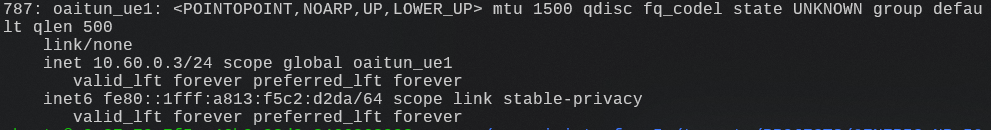
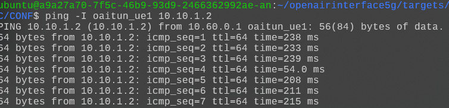

# Connect L25GC+ with OAI RAN
- This document describes the procedure to connect L25GC+ with the OAI RAN.
    - Reference: [openairinterface5g/doc/NR_SA_Tutorial_OAI_nrUE.md](https://github.com/OPENAIRINTERFACE/openairinterface5g/blob/develop/doc/NR_SA_Tutorial_OAI_nrUE.md)

## Steps
1. Install prerequisite packages
    ```
    sudo apt update
    sudo apt install git cmake
    sudo apt-get install build-essential
    ```
2. Clone OAI Repository
    ```
    cd ~
    git clone https://gitlab.eurecom.fr/oai/openairinterface5g.git
    cd openairinterface5g
    git checkout 2025.w18
    ```
    > In this document, we use the latest weekly release of OpenAirInterface (2025.w18).
3. Build
    ```
    cd ~/openairinterface5g
    source oaienv
    cd cmake_tagets
    ./build_oai -I --gNB --nrUE -w SIMU
    ```
4. Setup configuration
    - `targets/PROJECTS/GENERIC-NR-5GC/CONF/gnb.sa.band78.fr1.106PRB.usrpb210.conf`
        ```diff
        --- a/targets/PROJECTS/GENERIC-NR-5GC/CONF/gnb.sa.band78.fr1.106PRB.usrpb210.conf
        +++ b/targets/PROJECTS/GENERIC-NR-5GC/CONF/gnb.sa.band78.fr1.106PRB.usrpb210.conf
        @@ -11,7 +11,7 @@ gNBs =

            // Tracking area code, 0x0000 and 0xfffe are reserved values
            tracking_area_code  =  1;
        -    plmn_list = ({ mcc = 001; mnc = 01; mnc_length = 2; snssaiList = ({ sst = 1; }) });
        +    plmn_list = ({ mcc = 208; mnc = 93; mnc_length = 2; snssaiList = ({ sst = 1; sd = 0x010203; }) });

            nr_cellid = 12345678L;

        @@ -158,13 +158,13 @@ gNBs =


            ////////// AMF parameters:
        -    amf_ip_address = ({ ipv4 = "192.168.70.132"; });
        +    amf_ip_address = ({ ipv4 = "172.16.1.2"; });


            NETWORK_INTERFACES :
            {
        -        GNB_IPV4_ADDRESS_FOR_NG_AMF              = "192.168.70.129/24";
        -        GNB_IPV4_ADDRESS_FOR_NGU                 = "192.168.70.129/24";
        +        GNB_IPV4_ADDRESS_FOR_NG_AMF              = "172.16.1.1/24";
        +        GNB_IPV4_ADDRESS_FOR_NGU                 = "192.168.1.1/24";
                GNB_PORT_FOR_S1U                         = 2152; # Spec 2152
            };
        ```
        > Ensure the IP addresses and subnet masks match your network topology.
    - `targets/PROJECTS/GENERIC-NR-5GC/CONF/ue.conf`
        ```
        uicc0 = {
        imsi = "208930000000003";
        key = "8baf473f2f8fd09487cccbd7097c6862";
        opc= "8e27b6af0e692e750f32667a3b14605d";
        dnn= "internet";
        nssai_sst=1;
        nssai_sd=0x010203;
        }

        position0 = {
            x = 0.0;
            y = 0.0;
            z = 6377900.0;
        }

        @include "channelmod_rfsimu_LEO_satellite.conf"
        ```
5. Run gNB in simulation mode 
    ```
    cd ~/openairinterface5g/cmake_targets/ran_build/build
    sudo ./nr-softmodem -O ../../../targets/PROJECTS/GENERIC-NR-5GC/CONF/gnb.sa.band78.fr1.106PRB.usrpb210.conf --gNBs.[0].min_rxtxtime 6 --rfsim
    ```
6. Run the ue in simulation mode
    ```
    cd ~/openairinterface5g/cmake_targets/ran_build/build
    sudo ./nr-uesoftmodem --rfsim --rfsimulator.serveraddr 127.0.0.1 -r 106   --numerology 1 --band 78 -C 3619200000 --ssb 516 -O ../../../targets/PROJECTS/GENERIC-NR-5GC/CONF/ue.conf
    ```

## Test connection
- OAI will create a virtual network interface on successful UE registration
    
- Ping test result
    
    > In this screenshot, `10.10.1.2` corresponds to the data network (DN) interface used in our test setup.
    