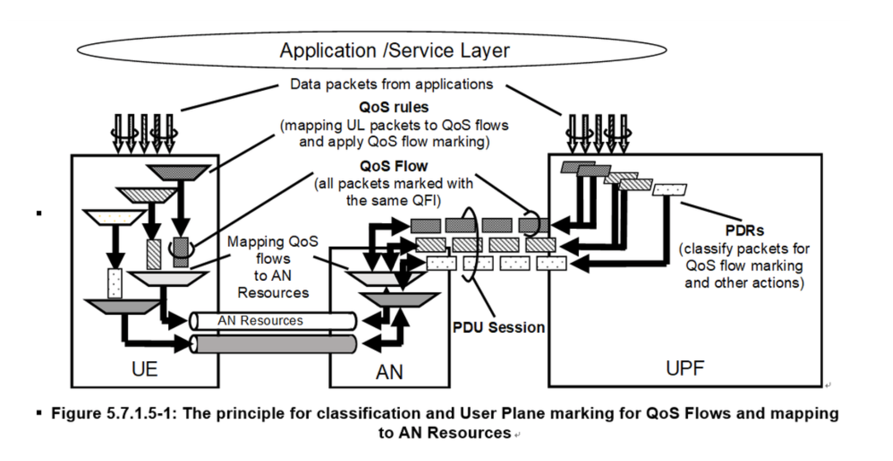
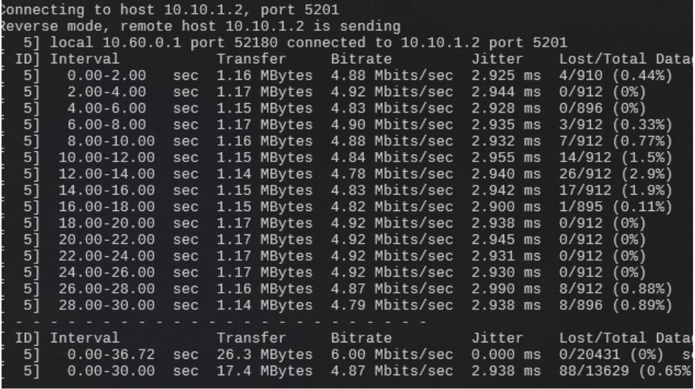
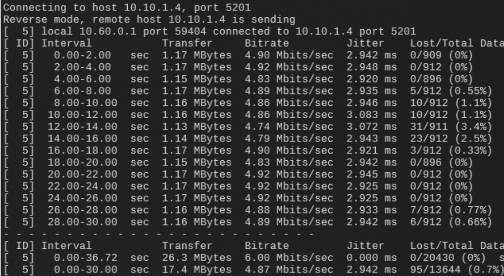

## QoS design document
This document describes the high-level QoS system design for L25GC+ and shows some experimental results.

### Introduction

The QoS in the 5G system can be considered as the below figure.



By combining the trTCM and Token Bucket algorithms, fine-grained control of network traffic is achieved, ensuring that different types of traffic receive the required bandwidth and quality of service.

### System Architecture

- **trTCM**
    - Used to implement QoS Flow traffic shaping, classifying traffic into red, yellow, and green colors based on traffic characteristics to indicate different service levels.
- **Token Bucket**
    - Used for traffic shaping and rate limiting by controlling the issuance and consumption of tokens to smooth traffic.
- **UE IP Address Table**
    - Used to store the IP addresses of user equipment (UE) and the corresponding traffic shaping parameters.

### Workflow

1. **Packet Arrival**
     - Look up the corresponding record in the UE IP Address Table based on the UE IP address in the packet.
2. **QoS Flow Processing**
     - If the corresponding record is found and the traffic belongs to QoS flow:
         - **trTCM Processing**: Use the trTCM library to classify the packet and decide whether to discard or forward it based on the color result.
         - **Token Bucket Processing**: Decide whether to allow the packet to pass based on the color result from trTCM and the number of tokens in the token bucket.
     - If the corresponding record is found but the traffic does not belong to QoS flow:
         - **Token Bucket Processing**: Directly process the packet using the token bucket algorithm.
3. **Non QoS Flow Processing**
     - If no corresponding record is found, the traffic is considered to belong to Non-QoS flow.
         - **Token Bucket Processing**: Process the packet using the token bucket algorithm.
4. **Token Bucket Update**
     - Whether it is QoS flow or Non QoS flow, the number of tokens in the corresponding token bucket needs to be updated after each packet is processed.
        - `QoS token Rate =  min ((GBR + (AMBR-GBR)/2 ) , MBR)`
        - `Non QoS token rate = AMBR - QoS Rate`

    
    The diagram shows our workflow. When traffic arrives, it is classified as either QoS flow or Non-QoS flow and processed through the corresponding bucket. Additionally, QoS flow undergoes extra trTCM processing.


### QoS Parameters

- **MBR (Maximum Burst Rate)**: The upper limit of traffic shaping.
- **GBR (Guaranteed Bit Rate)**: The lower limit of traffic shaping.
- **AMBR (Aggregate Maximum Bit Rate)**: The maximum bit rate allowed for all non-GBR bearers.

### Experimental Results

The following section presents the experimental results obtained from implementing the QoS system. These results demonstrate the effectiveness of the trTCM and token bucket algorithms in managing network traffic and ensuring the required quality of service for different types of traffic.

#### QoS Parameters
- GBR = 2 Mbps
- MBR = 5 Mbps
- AMBR = 10 Mbps
- Flow description : permit out ip form any to 10.10.1.2

#### UE and DN IP
- UE IP: 10.60.0.1
- Two DN IP: 10.10.1.2, 10.10.1.4
    ```
    iperf3 -c 10.10.1.2 -p 5201 -B 10.60.0.1 -u -b 10M -R
    ```

    ```
    iperf3 -c 10.10.1.4 -p 5201 -B 10.60.0.1 -u -b 10M -R
    ```

The displayed results are shown below:




From the images, we can see that the QoS flow is limited to below 5 Mbps and the traffic is evenly distributed with the non-QoS flow.


 
