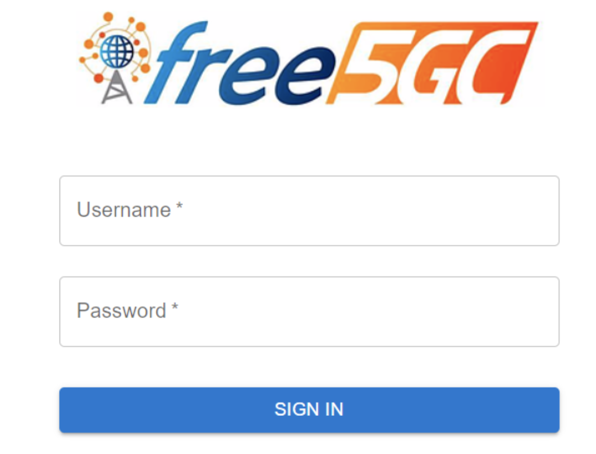
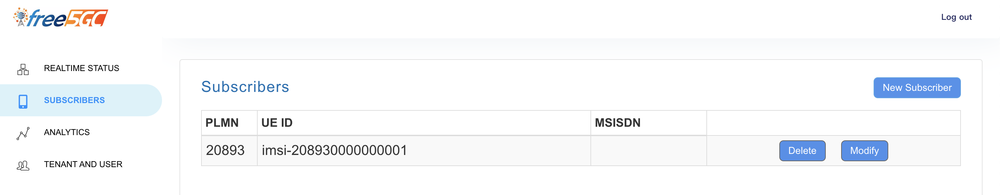
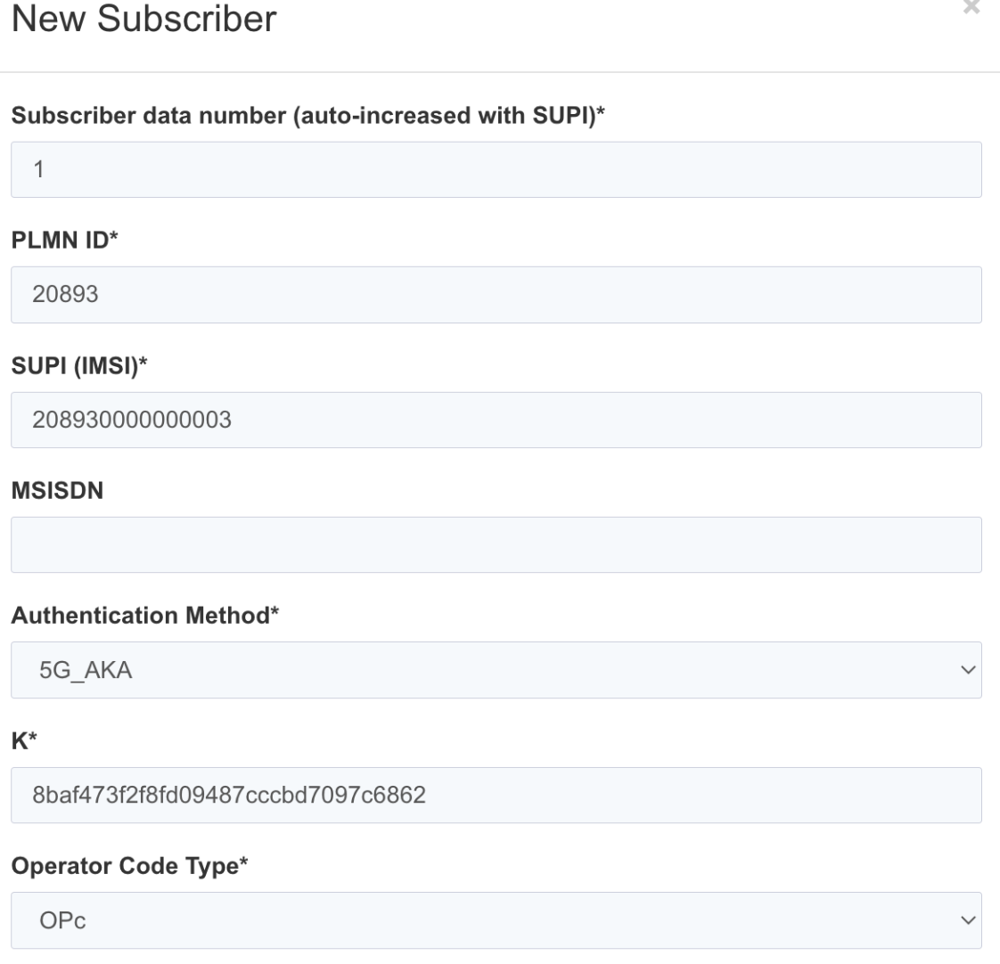
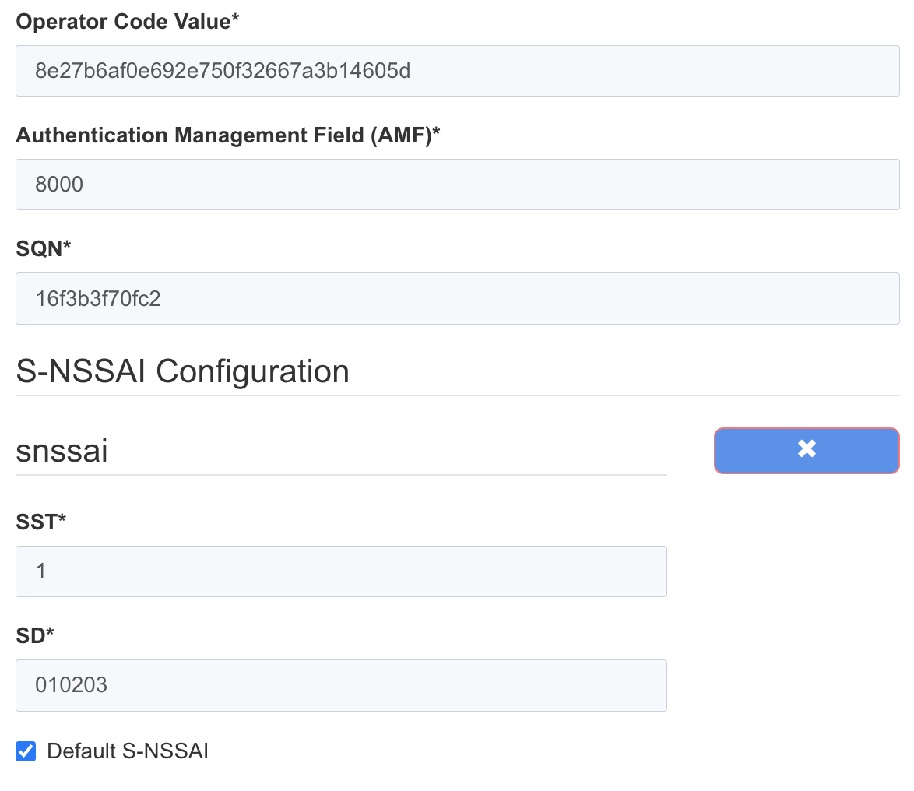
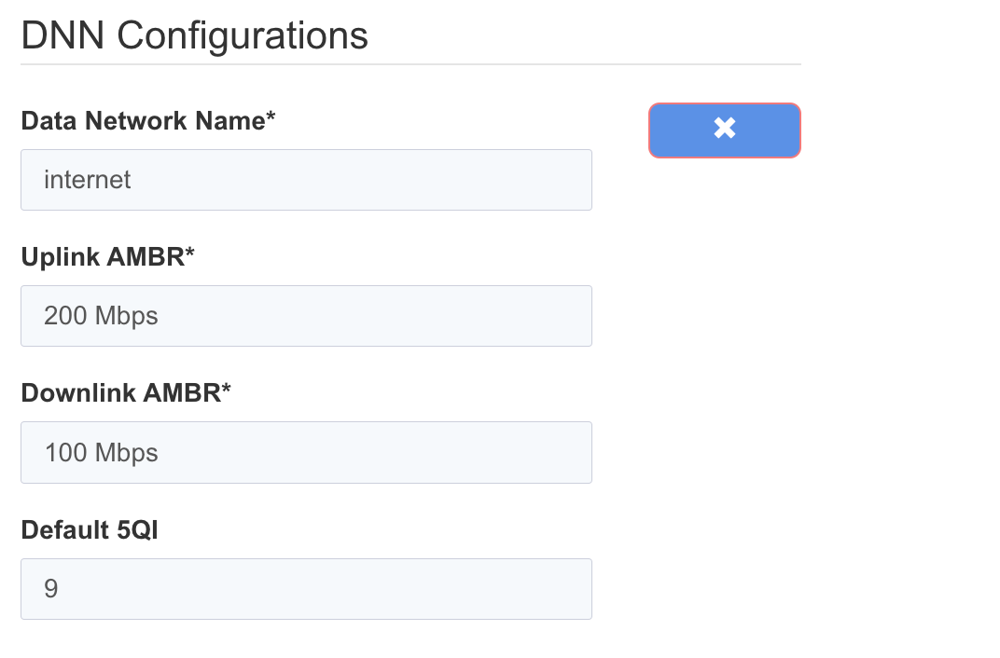
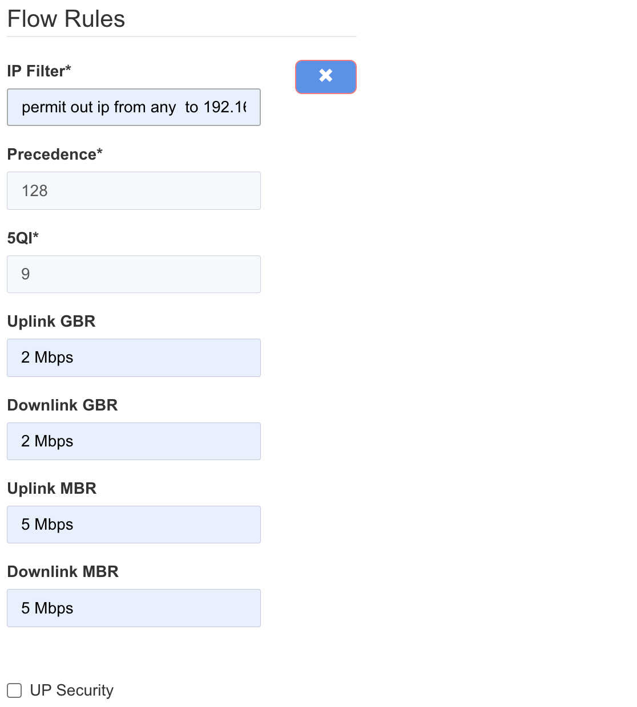
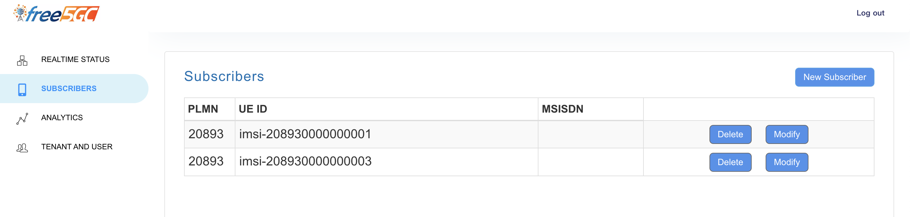

# Create Subscriber via Webconsole

## 1. Install Webconsole

If Webconsole isn't installed yet, please, follow the instructions from [GitHub page](https://github.com/free5gc/webconsole).

## 2. (Optional) Delete MongoDB database

If another version of free5GC was ran before, you have to delete MongoDB.
```
$ mongo --eval "db.dropDatabase()" free5gc
```

## 3. Run Webconsole server
```
$ cd ~/free5gc/webconsole
$ go run server.go
```

## 4. Open Webconsole
Enter URL: `<Webconsole server's IP>:5000` in browser



Default credential:
```
Username: admin
Password: free5gc
```

## 5. Add new subscriber

- Directly create subscriber in create subscriber page

### 5.1. Directly create subscriber in create subscriber page

> Click `SUBSCRIBERS` -> `New subscribers`



> Edit the Subscriber's data and click `New subscribers`, here you can configure the 
- **Network Slicing** Configuration
    - SST/SD (Slice/Service Type and Slice Differentiator)
    - **DNN** (Data Network Name) Configuration
        - AMBR (Aggregate Maximum Bit Rate)
            - Maximum total uplink/downlink bitrate limits
        - Default 5QI (5G QoS Identifier)
            - Default Quality of Service identifier
            - GBR type (5QI values: 1-4, 65-67, 71-76)
            - Non-GBR type (5QI values: 5-9, 69-70, 79-80)
        - **Flow** Configuration
            - IP Filter
                - Source/destination IP address ranges
                - CIDR Format (eg: "140.113.0.0/16") 
            - Precedence
                - Priority of flow rules (lower value means higher priority)
            - 5QI (Flow-specific QoS identifier)
                - Non-GBR flows: Best effort traffic, no bandwidth guarantee
                - GBR flows: Guaranteed bit rate for specific services
            - Uplink GBR/MBR (Guaranteed/Maximum Bit Rate)
                - Applicable for GBR 5QI flows
            - Downlink GBR/MBR (Guaranteed/Maximum Bit Rate)
                - Applicable for GBR 5QI flows

    
    
    
    

> Check that the `Submit` was added successfully
    