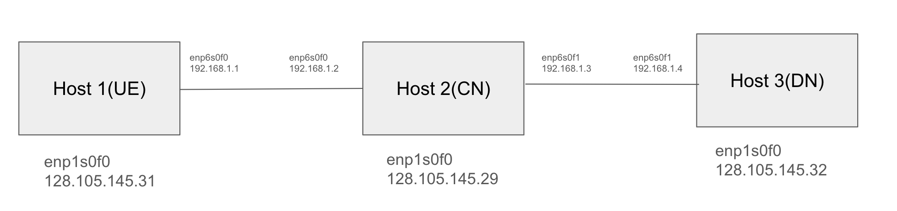

## System Architecture ##



## Installation ##

### Core Network ###

~~~
# set up ip route
cd $HOME
sudo ip route del 192.168.1.0/24 dev enp6s0f1
sudo ip route add 192.168.1.4/32 dev enp6s0f1
~~~

~~~
./CNenvironment.sh
~~~

### UE  ###

~~~
./UEenvironment.sh
~~~

### DN  ###

~~~
sudo ip route add 10.60.0.0/24 enp6s0f1
sudo arp -s 10.60.0.1 <CN MAC ADDRRESS>
~~~

### Setting L25GC-plus Parameters
In L25GC-plus VM, we need to edit three files:

- `~/L25GC-plus/config/amfcfg.yaml`
- `~/L25GC-plus/config/smfcfg.yaml`
- `~/onvm/onvm-upf/5gc/upf_u_complete/upf_u.txt`
First SSH into L25GC-plus VM, and change `~/L25GC-plus/config/amfcfg.yaml`:
```
cd ~/L25GC-plus
nano config/amfcfg.yaml
```

Replace ngapIpList IP from `127.0.0.1` to `128.105.145.29`, namely from:
```
...
  ngapIpList:  # the IP list of N2 interfaces on this AMF
  - 127.0.0.1
```
into:
```
...
  ngapIpList:  # the IP list of N2 interfaces on this AMF
  - 128.105.145.29  # 127.0.0.1
```

Next edit `~/L25GC-plus/config/smfcfg.yaml`:
```
nano config/smfcfg.yaml
```
and in the entry inside `userplaneInformation / upNodes / UPF / interfaces / endpoints`, change the IP from `127.0.0.8` to `192.168.1.2`, namely from:
```
...
  interfaces: # Interface list for this UPF
   - interfaceType: N3 # the type of the interface (N3 or N9)
     endpoints: # the IP address of this N3/N9 interface on this UPF
       - 127.0.0.8
```
into:
```
...
  interfaces: # Interface list for this UPF
   - interfaceType: N3 # the type of the interface (N3 or N9)
     endpoints: # the IP address of this N3/N9 interface on this UPF
       - 192.168.1.2  # 127.0.0.8
```

Next edit `~/onvm/onvm-upf/5gc/upf_u_complete/upf_u.txt`:

```
# DN MAC Address
3c:fd:fe:b4:fd:6d
# AN MAC Address
3c:fd:fe:b0:ef:f4
# UPF ID Address
10.10.1.2
```
into:
```
# DN MAC Address
90:e2:ba:b5:15:81
# AN MAC Address
90:e2:ba:b5:14:30
# UPF ID Address
192.168.1.2
```

~~~
90:e2:ba:b5:15:81 is  Host3 enp6s0f1 MAC ADDRESS
3c:fd:fe:b0:ef:f4 is  Host1 enp6s0f0 MAC ADDRESS
192.168.1.2       is  Host2 enp6s0f0 MAC ADDRESS
~~~

### Setting UERANSIM Parameters
In the ueransim VM, there are two files related to L25GC-plus：

- `~/UERANSIM/config/free5gc-gnb.yaml`
- `~/UERANSIM/config/free5gc-ue.yaml`

The second file is for UE, which we don’t have to change if the data inside is consistent with the (default) registration data we set using WebConsole previously.

First SSH into ueransim, and edit the file `~/UERANSIM/config/free5gc-gnb.yaml`, and change the ngapIp IP from `127.0.0.1` to `128.105.145.29`, gtpIp IP from `127.0.0.1` to `192.168.56.102`，and also change the IP in amfConfigs into `128.105.145.29`, that is, from:
```
...
  ngapIp: 127.0.0.1   # gNB's local IP address for N2 Interface (Usually same with local IP)
  gtpIp: 127.0.0.1    # gNB's local IP address for N3 Interface (Usually same with local IP)

  # List of AMF address information
  amfConfigs:
    - address: 127.0.0.1
```
into:
```
...
  ngapIp: 128.105.145.29  # 127.0.0.1   # gNB's local IP address for N2 Interface (Usually same with local IP)
  gtpIp: 192.168.1.1  # 127.0.0.1    # gNB's local IP address for N3 Interface (Usually same with local IP)

  # List of AMF address information
  amfConfigs:
    - address: 128.105.145.29  # 127.0.0.1
```
